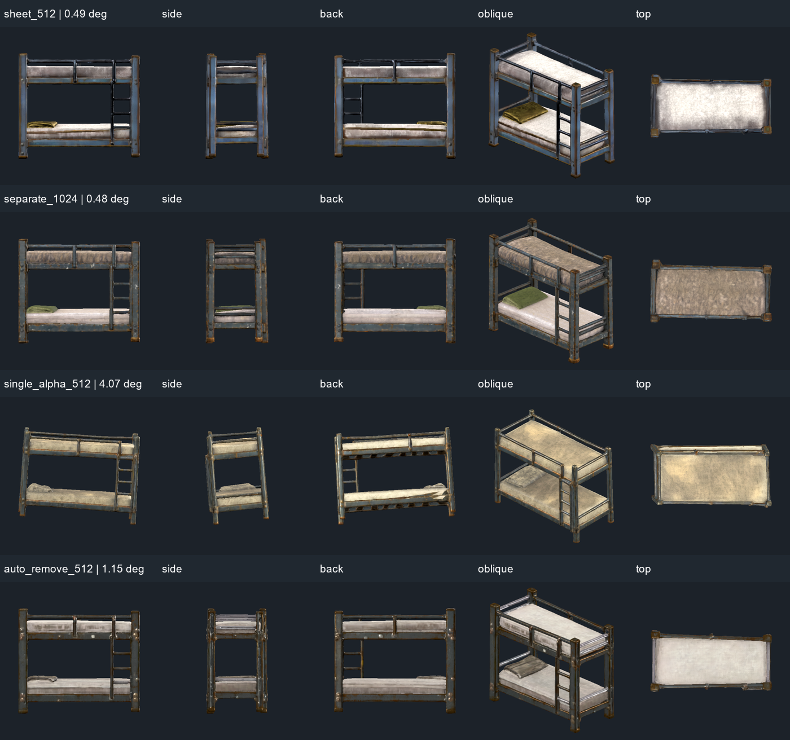
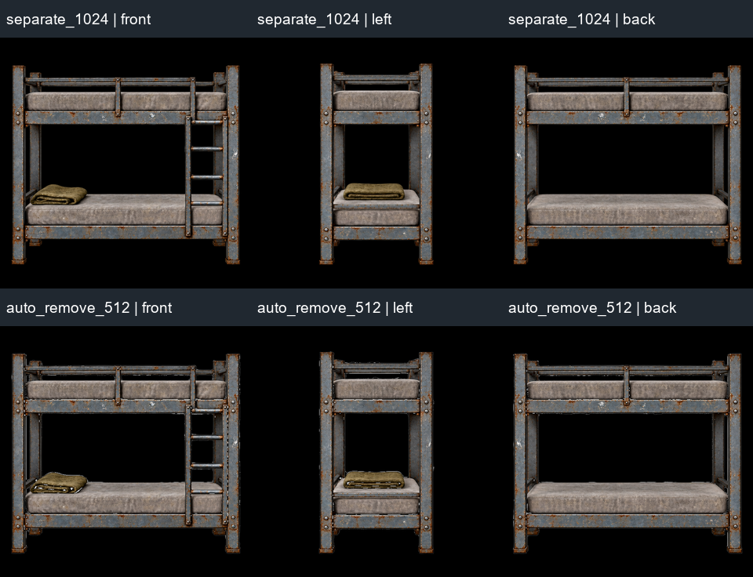

# Pixal3D API V2 實作與床測試

2026-10-05。V2 已安裝到 `C:\Users\evan4\Apps\Pixal3D-API-v2`，接替 `http://127.0.0.1:8000`；API 文件在 `/docs`。可審查的來源與使用說明：[tools/pixal3d_api](../../tools/pixal3d_api/README.md)。沿用原 ComfyUI `8188`、Python 3.12.10、既有 INT8 權重，沒有下載新權重或改動模型 runtime。RV 修改前已 fetch 並合併當時的 `origin/main`（96a1fe3），交付前再次 fetch 確認 main 未變更。

## 解決的問題

[先前床研究](../research/pixal3d-bed-straightness.md) 找到舊 API 逐張依 mask 裁切、放大三視圖，端面因此比正面放大約 14.5%。V2 的多視圖保留同尺寸方形畫布，統一轉為 1024×1024；透明圖直接使用 alpha，照片去背只套 mask，不再逐張裁切。這保留原圖中的共同相機尺度。

新增 `POST /jobs/multiview`，分開上傳正面、左側、背面及選填右側；原 `POST /jobs` 仍接受單圖與正面／左側／背面的三等方格圖板。圖板必須精確 3:1，獨立視圖必須同尺寸且為正方形，錯誤輸入在排隊前被拒絕。加入 FOV、背景處理選項，以及準備後的圖、實際 ComfyUI conditioning 圖下載。單圖仍有原物件裁切流程，alpha 輸入不再重做去背；單圖 FOV 可指定或由 MoGe 估計。

每個工作保存原圖、準備後的 PNG、精確 graph、history、conditioning 及 GLB。Idempotency key 的配置檢查跨重啟保存；已保存 prompt 的工作只恢復追蹤，不重送。佇列等待共用後端空閒，不使用全域 interrupt。成功需所有 conditioning 與 GLB 收齊、尺寸／容器／SHA 檢查通過。Windows ComfyUI 回傳的反斜線相對目錄會安全正規化，再檢查工作目錄範圍。

## 本輪實際驗證

使用同一個床設計、seed 42、FOV 20。黑底三視圖與白底測試圖來自既有 [共同畫布參考圖](../../art_source/bunker_bunk_bed/straightness_trials/framed_v2/framed_reference.png)；透明單圖使用 [平視單圖](../../art_source/bunker_bunk_bed/straightness_trials/level_reference.png)。白底為確定性的測試 fixture：原圖純黑區換成白色，前景像素原位保留，供 `auto` 去背路徑驗證。

| 測試 | 入口與模式 | 完成 prompt | 局部柱向平均傾角 |
| --- | --- | --- | --- |
| sheet_512 | `/jobs`，threeview512，黑底圖板 | 96eedfa7-56d6-412b-a26e-8f292b4cb543 | 0.49° |
| separate_1024 | `/jobs/multiview`，threeview1024，分開三圖 | d73dc52d-87fb-4d52-9b6d-318c8e2baf76 | 0.48° |
| single_alpha_512 | `/jobs`，preview512，原 alpha | 486b6801-a22e-4360-a930-7235ffb9080c | 4.07° |
| auto_remove_512 | `/jobs/multiview`，threeview512，白底自動去背 | 0ee11121-078d-46d4-bdf5-584f9a56fdb0 | 1.15° |

上述角度延續床研究的診斷：面積加權取樣 200,000 點，在高度 40–65% 的四角空隙估計柱向，僅作 yaw 旋轉、不修 mesh。它不代表整根柱子、床框或床腳已筆直。單圖和三視圖的參考圖與流程都不同，不能把差異全部歸因於單一 API 參數。視覺上三視圖減少整體歪斜，仍有局部框線、接頭與腳底瑕疵。

圖板與分開上傳的三張 conditioning **逐像素相同**；兩種入口不會導致不同的視圖倍率。黑底正面／左側／背面的非黑像素高度為 822／828／818 px，差異來自原參考圖與重採樣，而非各視圖重新放大。白底去背的結果同為 1024×1024，照片去背仍可能改變局部輪廓。

本輪檢查：

- **24/24** Python 單元與真 HTTP 測試通過，包含輸入驗證、共同畫布、alpha、去背 graph、FOV、持久化 idempotency、prompt 重啟恢復、輸出缺失／尺寸錯誤、路徑範圍、GLB 摘要及舊完成工作相容性。
- **4/4** 真 ComfyUI 床生成與 GLB 下載成功，所有 conditioning PNG 下載、尺寸與 GLB SHA256 相符。
- 第一個 512 工作生成中強制停止測試 API，再啟動後沿用同一 prompt。首次收檔發現 Windows 目錄分隔符相容問題；修正後恢復收取**同一個已完成 prompt**，未重新生成。該工作總 elapsed 含修正時間，不作速度比較。
- **4/4** GLB 由 Godot 4.7.2 載入並完成 **20 張**五視角渲染，exit code 0，正常權限重跑後日誌無腳本或引擎錯誤。沒有修改原 mesh 或獨立軸拉伸。
- 切到 8000 後，健康檢查 ready、active=queued=0、docs／OpenAPI 正常；四個新 job 的 GLB 與 conditioning 下載保持一致。再次啟動腳本辨識既有 V2，不開第二個服務。
- 舊床 job `56651a5d-b8c6-44ce-8eec-6e4c0848fdb7` 的 GLB 與原 SHA 相符，舊 metadata 原字節未變。舊結果標記 legacy；不存在的 V2 inputs 路由回傳 404。

[生成、尺度、量測與來源摘要](evidence/pixal3d-api-v2/report.json)；[正式入口與舊工作相容性檢查](evidence/pixal3d-api-v2/production.json)。完整原始輸出、prompt、history 在 Apps V2 的 `jobs/<job_id>/`，額外 Godot 預覽、量測與實測紀錄保存在 `validation/2026-10-05/`。不把運行中的工作資料加入 Git。

## 交付範圍

新 API 與使用指南已交付；舊 API 程式、工作、ComfyUI 和權重均保留。停止／重啟腳本只管理自己的 API，普通停止會拒絕尚未完成的工作。舊成功工作的 status／result／GLB 維持唯讀下載；未完成的舊工作不由 V2 重新排隊。

床建議先用 `threeview512` 確認畫布一致，再用 `threeview1024`、FOV 20 生成候選。參考圖使用同鏡頭、水平相機、共同像素高度，透明或乾淨黑底可減少去背輪廓變動。API 只能檢查畫布尺寸，不能自動辨認圖中物件的實際尺寸是否相同。

所有生成結果仍需美術驗收。API 回傳 `needs_art_review=true`，Godot／Blender tested flags 維持 false；上述 Godot 載入與渲染是另外執行的本輪測試。未做 Blender 修形、碰撞／攀爬接口、正式場景替換或玩法回歸。先前 18 個候選與床研究的測試是歷史記錄，不列入本輪重新執行的檢查。
