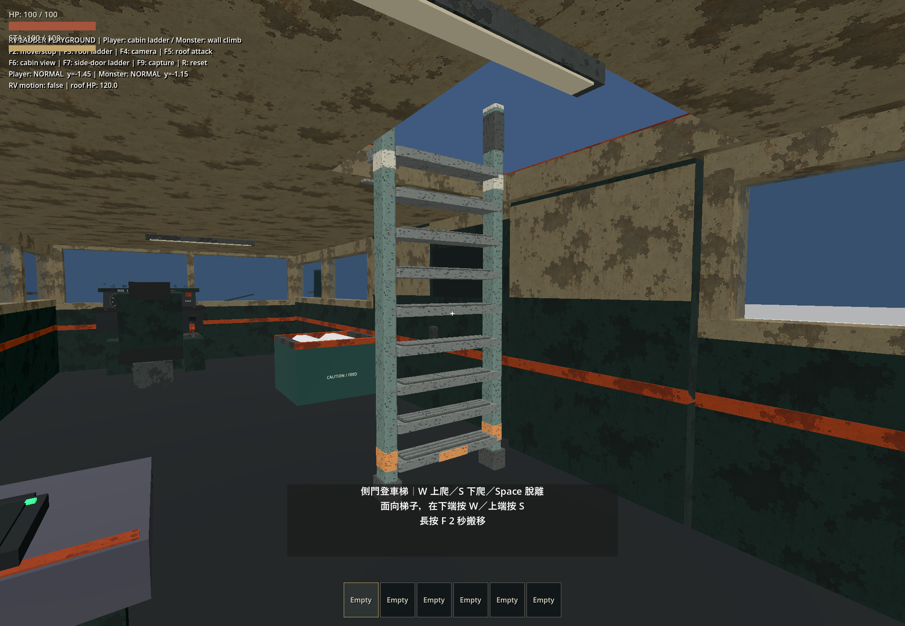
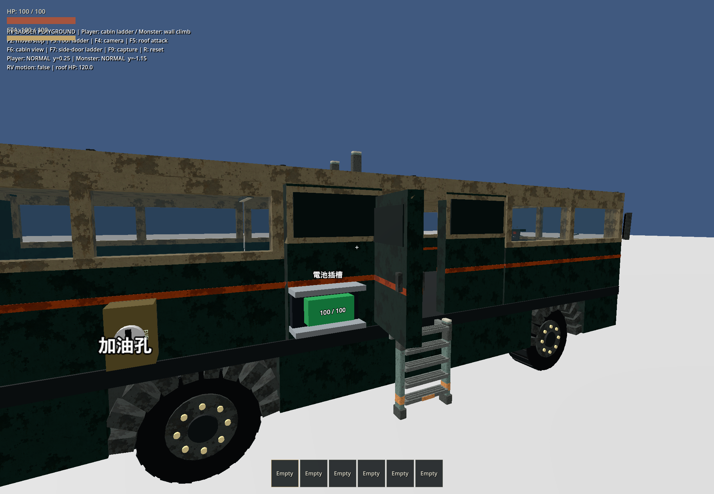
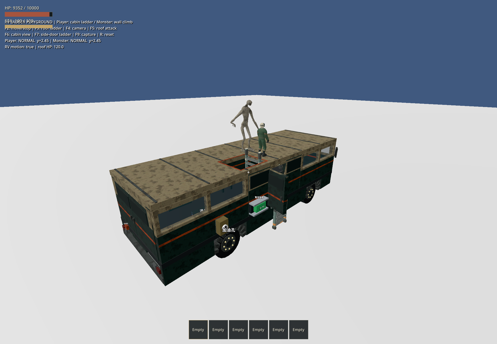
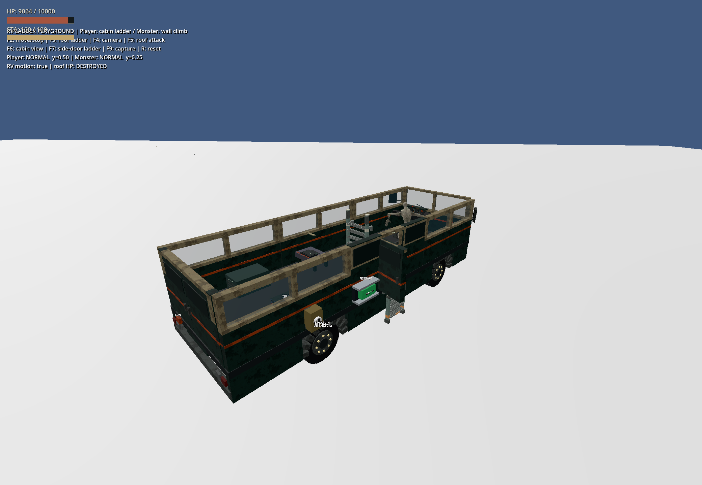

# 可搬移 RV 梯子與屋頂開口

> 初版紀錄：配置與固定側門梯位已被 [貼牆梯子重做](2026-10-05-rv-wall-ladders.md) 取代。下列圖片、行為及結果記錄初版狀態。

日期：2026-10-05。Godot 4.7.2 stable / Windows / Jolt，原生畫面使用 Forward+、RTX 4060 Laptop。保留工作樹既有的固定車體結構／施工修改；沒有建立建模需求單。

## 完成行為

- 玩家不再直接攀 RV 車壁；靠近梯子面向踏板，W 上爬、S 下爬、Space 脫離。怪物保留攀車能力。
- [側門登車梯](../../equipment/side_door_ladder.tscn)與[車內登頂梯](../../equipment/roof_ladder.tscn)均為 Equipment，長按 F 搬移，沿用取消、耐久、支撐依賴與 v4 保存。側門梯瞄準門可吸附固定門框梯位；門需開啟才能進入車內。
- 正式與起始 RV 都預裝兩座梯子。車內梯移至右側 x=1.05 m，保留中央搬運走道；屋頂在 x=0.35–1.75、z=0.6–2.2 m 留下真正的網格及碰撞開口。屋頂仍為一個固定槽與一份耐久。
- 進出梯子與每步移動保留完整膠囊碰撞，關門、頭頂障礙或缺少站立面均不能穿越。梯子移動、禁用、毀壞或失去支撐會解除攀附；行車平移、轉彎與脫離速度沿用 RV 支撐。
- 地面梯子歸 WorldEntities，地形支撐卸載不會連帶刪除梯子。鬆散設備存檔沿用原格式，沒有新增靜態地面支撐 ID。
- [原創 GLB 與貼圖](../../assets/models/rv_ladders/README.md)直接完成：深綠漆、奶油白端蓋、橘色辨識帶、金屬防滑踏板及橡膠脚套。來源 [build_rv_ladders.py](../../scripts/build_rv_ladders.py)，短梯 1,216、長梯 1,808 三角形，內嵌 128px 磨損貼圖。Blender MCP 當時無連線，改以確定性網格作者程式產出，非灰盒待交付。

## 本輪自動檢查

29 個不同測試通過，分批執行而非 full suite：

| 批次 | 結果 | 日誌目錄（`.godot/test-logs/`） |
|---|---|---|
| quick | 21 / 21，53.41 秒 | `20261005-220705-823-quick-44396` |
| 攀爬／動作／缺肢／大型物品／原路線搬運登車 | 7 / 7，26.41 秒 | `20261005-220609-921-selected-45480` |
| 檢查點／結構／天氣／燈條／施工／梯子 | 7 / 7，50.05 秒 | `20261005-220840-744-selected-45976` |
| 最終純能力 helper 複查 | 1 / 1，2.05 秒 | `20261005-221002-617-selected-31248` |
| 正式主場景 smoke | PASS，26.92 秒（含匯入） | `20261005-221307-610-smoke-10444` |

新 [test_rv_ladders.gd](../../tests/test_rv_ladders.gd) 已列入 quick。實際驗證車壁拒絕、兩種梯子上下行、門扇正常開啟、閉門／封住開口阻擋、相對車輛位置、S 下降、移動／取消／毀損／支撐移除、實際瞄準與左鍵放置、設備和鬆散物件的 ID／位置／耐久／凍結狀態保存及地形支撐卸載。

初版中央梯擋住直線搬引擎登車，改為右側配置後，原本的直線搬運測試直接通過，沒有改成繞路或移除障礙。地板毀損的預期設備重量增加 RoofLadder；保留實際重量和重心斷言。下降動畫以攀升循環反向播放，另驗證實際播放時間遞減。

## 本輪原生視窗觀察

使用安裝的 computer-use skill，透過 `@oai/sky` 選取唯一的 `ApocalypseRV - Ladder Acceptance (DEBUG)` 遊戲視窗；未操作 Godot 編輯器。

1. F7：側門開啟後，觀察玩家由短梯攀入車廂，恢復 NORMAL；關門阻擋另由自動測試驗證。
2. F3：玩家由右側車內梯穿过屋頂開口登頂，怪物沿外牆登頂；两者在腳本驅動的移動及轉彎中留在車上。
3. F5：玩家入座後，怪物砸頂至 HUD 顯示 `DESTROYED`，怪物落到車內地板；車內梯因支撐為地板而保留。
4. F6：觀察完整車內梯、防滑踏板、貼圖、屋頂開口及中央淨空；F9 保存遊戲內視圖。

最終原生日誌 `.godot/ladder-art.log` 未發現腳本或引擎錯誤。較早 sandbox 啟動有系統憑證／shader cache 寫入限制，改在可見桌面執行後正常。第一次 smoke 因 sandbox 不能寫 Godot editor settings 停在匯入，使用授權的正常引擎環境重跑後，匯入及正式主場景均通過。只關閉本輪測試視窗。

## 範圍

回放使用腳本車輛運動；本輪未做實機輪驅操控、極端翻覆或怪物群驗收，未宣稱 full suite 通過。模型位置與尺寸由場景維護，開口目前為固定開放式，沒有活動艙蓋。
