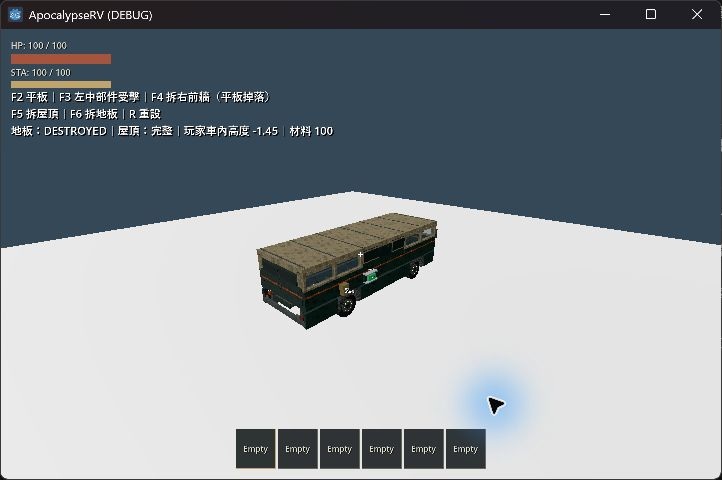

# RV 固定結構與平板施工驗證（2026-10-05）

本輪將車殼從 Equipment 拆成 RVStructurePanel／RVStructureDefinition，保留既有外觀；六個側槽、前牆、後門、屋頂、地板共十槽。實作範圍和數值見 [GDD](../../GDD.md) 與 [架構](../../architecture.md)。

## 功能與保存

- 結構不提供 F 搬移或 H 維修；一般設備仍保留原操作。側牆與側門可由平板互換，保留耐久比例。
- 平板維修 2 Metal Parts／2 秒補 60 HP，重建 6／6 秒，變型 2／4 秒；完成前重驗條件並扣料，取消不扣料。加入操作者死亡或離開 UI 模式的最後一幀防護。
- 牆、門、頂、地板各自受傷；毀壞移除該片碰撞並保留槽位狀態，附掛設備連鎖停機掉落。新地板分離原底盤 200 kg 及相應力矩，不重複計重。
- 平板免疫所有傷害且不是怪物目標，仍能搬移、因支撐損失掉落。
- Checkpoint／VehicleSnapshot v4 保存獨立結構與具類型的支撐引用；預設 `user://rv_checkpoint_v4.save`。v1–v3 不轉換，原檔及備份保留。

## 本輪自動驗證

使用 Windows、Godot 4.7.2，透過 `scripts/test.ps1`。完整範圍加修正後重測共涵蓋 109 項不同檢查，最新結果為 **108 PASS、1 FAIL**；不是一次 full 全綠。車體、施工、支撐、登車、門、重量／重心、存檔回歸與正式主場景啟動均通過。未通過的是下述戶外追逐斷言。

| 本輪執行 | 結果與用途 | 日誌目錄（`.godot/test-logs/`） |
|---|---|---|
| 首輪 full 前段 | 前 14 項中 13 PASS；地堡搬運失敗後已修正，下一項手電筒世界逾時導致清理中止 | `20261005-205344-311-full-42632` |
| full 從手電筒世界接續 | 95 項全部執行，含正式主場景；89 PASS／6 FAIL，失敗逐項追查並重測 | `20261005-210012-562-full-47068` |
| 地堡搬運與施工補測 | 2 PASS，含操作者死亡／離開 UI 最後一幀取消 | `20261005-211020-384-selected-37852` |
| 最終修正與失敗項重測 | 8 項，7 PASS／1 FAIL；戶外追逐仍失敗，其餘全部通過 | `20261005-212335-858-selected-17208` |

最終八項為戶外追逐、小型 POI 保存、地堡 POI 保存、RV 檢查點、維修蓋／坡板／照明、輪驅操控、開場設備安裝及樹木撞擊。新 `test_structure_construction` 與 `test_rv_structure_snapshot` 均登錄 quick。`git diff --check` 與十份本輪文件的相對連結檢查通過。以下區分已修正的首輪問題與仍未解決項目。

- 首輪結構資源載入發現 Floor／Ceiling 的定義屬性早於 script，已調整所有板件場景屬性順序；相關存檔及施工測試重跑通過。
- 地板變為獨立碰撞後，維修蓋與坡板掃掠需排除原本包含於底盤的地板 RID；已補上，不排除玩家、道具或其他設備。維修蓋先建立本地排除陣列再指定查詢，避免修改 getter 回傳副本而未生效。
- 首輪 full 在 `test_flashlight_world` 90 秒逾時後無法於沙箱清理子程序；接續以正常桌面權限、預設 240 秒限制執行。此測試接續執行通過。
- `test_outdoor_encounter` 完整範圍執行及單獨重跑均出現 `Production monster crosses streamed seam and rotated gate`。同一斷言的既有不一致紀錄見 [2026-10-04 驗收](2026-10-04-issues-8-17.md)。本輪日誌有反覆死亡／重生；未修改該 fixture 或相關玩家／Raker 抓咬流程，未以此證明根因或宣稱與本輪完全無關。
- 更新仍假設 v3 遷移的 POI 保存測試；開場搬設備改驗證地板為支撐、底盤仍為設備父節點與 RV 連線。樹木撞击觀察器也納入獨立結構的接觸。
- 停車測試以同一幀的新位置／速度及既有濾波車速條件決定是否完成；原先停止條件採用等待前的縱向速度，與後續 `road_speed()` 斷言不同。原 1200 幀上限、位置 0.7 m 與車速 0.2 m/s 門檻均保留，未改實際操控。
- 保存新增實際平板施工情境，確認一般 UI 仍不能保存，施工中則優先提供「車體施工中」原因；不建立檔案，關閉平板取消後恢復一般模式。

## 本輪原生視窗觀察

使用 computer-use 的 sky 取得實際遊戲視窗並輸入，未操作 Godot 編輯器；每次操作後重新擷取畫面。驗證完已關閉本次遊戲視窗。

1. `rv_climb_playground.tscn -- --replay --climb-debug`：玩家與怪物攀上車頂，腳下支撐隨腳本車身轉彎保持。F5 入座後，怪物拆頂，HUD 顯示 `DESTROYED`，日誌支撐由 Ceiling 轉為 Floor，怪物落入車內。未使用此結果宣稱輪驅、翻車或群怪已驗收。
2. `rv_structure_playground.tscn`：F2 開啟實際平板，以滑鼠選「車體結構」頁；左中牆初始 30 HP，點擊維修後變為 90 HP，再選側門並施工，型態變為側門且仍 90 HP。兩次施工共耗 4 Metal Parts，材料 100 → 96。
3. F4 拆右前牆時平板介面立即關閉，牆板消失，支撐平板掉落。F5 屋頂消失，其餘側板仍在。
4. F6 拆地板後地板碰撞消失。站於中間橫樑上方的角色先落在保留的框架上；將測試起點設於框架空隙 z=2.6 再驗證，玩家車內局部高度由約 0.25 降至 -1.45，落到地面。車架、輪组仍保留。

原生日誌：`.godot/structure-climb-native.log`、`.godot/structure-ui-native.log`、`.godot/structure-floor-native.log`。這些執行未出現 script error；日誌／快取不納入版本控制。

## 限制

第一版只有現有側牆／側門互換，未新增升級品項或主動拆成空槽。新地板仍使用與其他車板一致的凍結剛體方式，車身完整受力、翻車與大量附掛物件不是本次原生視窗驗證的覆蓋範圍。舊外觀比較場景 `rv/legacy/` 保留展示用途，不代表舊檢查點相容。
