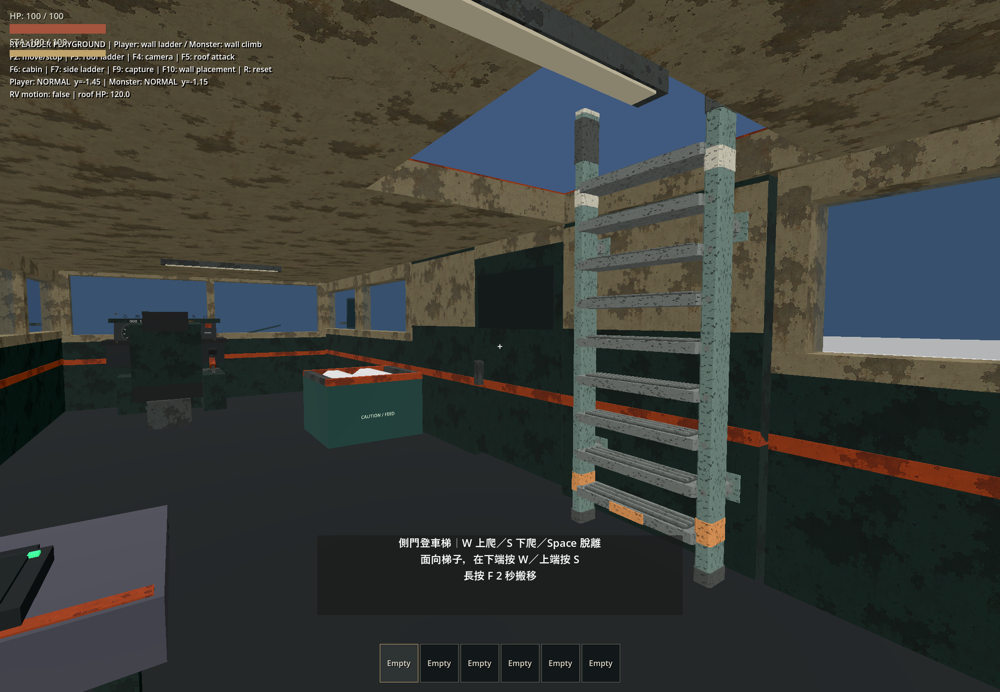
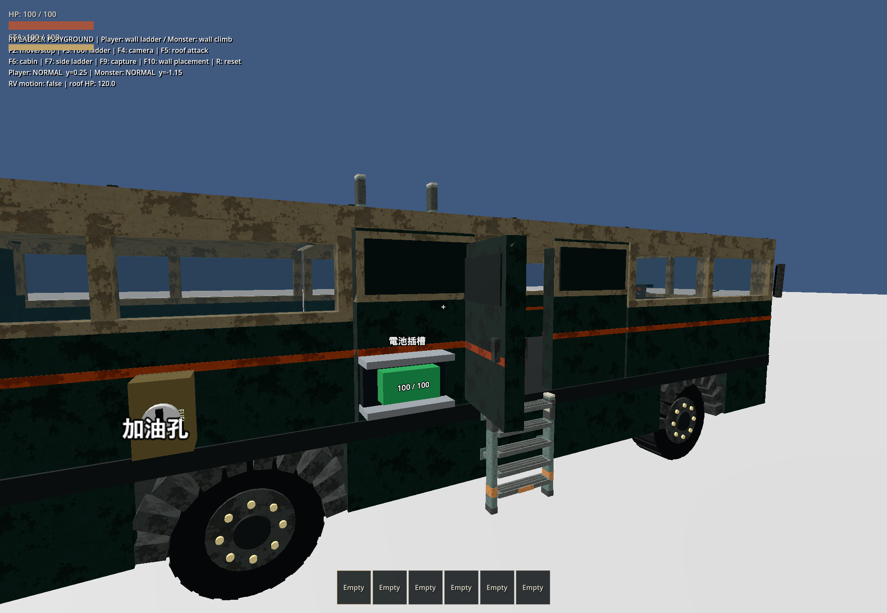
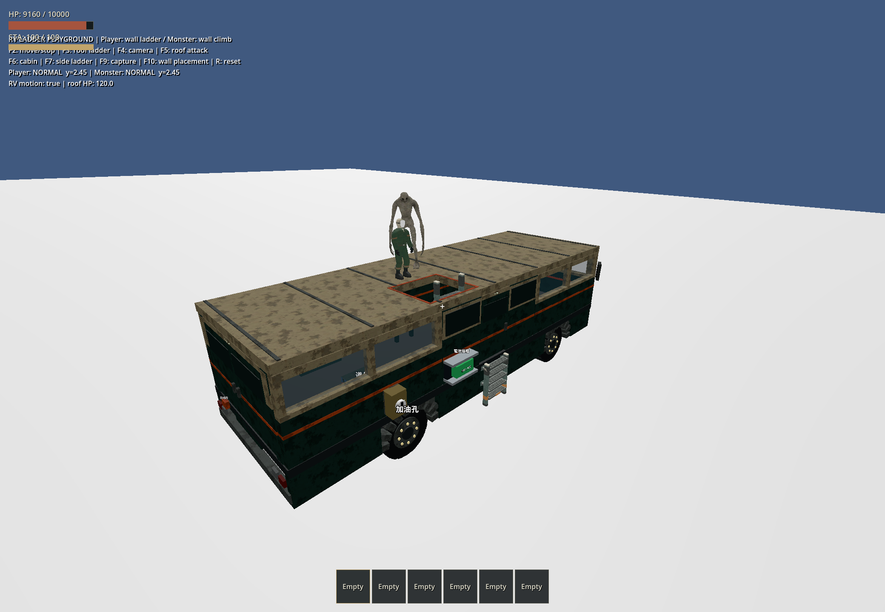
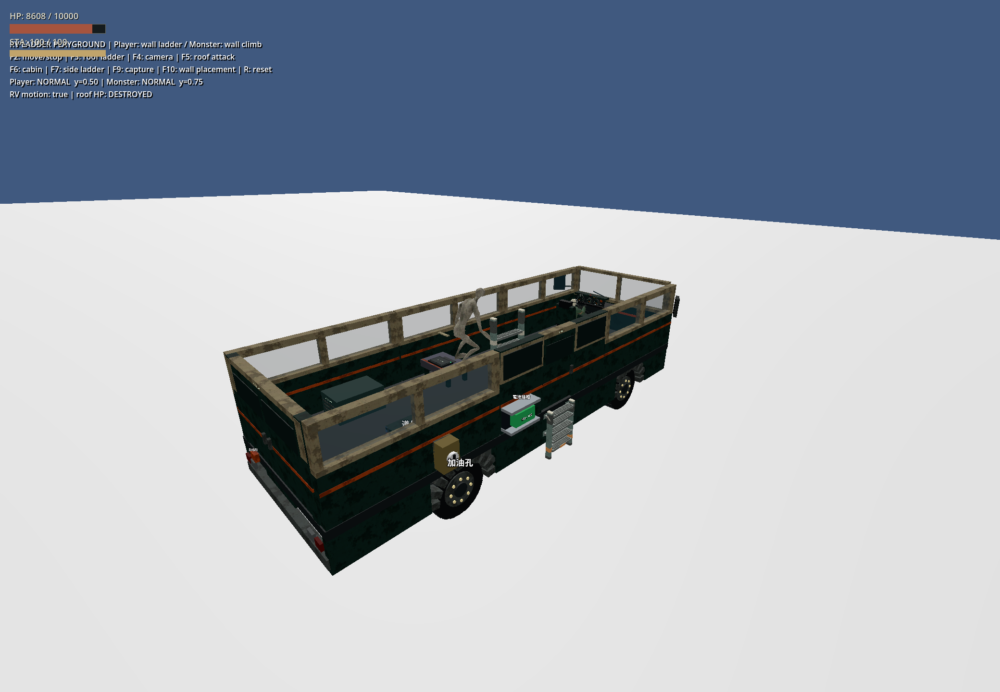

# 可搬移梯子：自由貼牆重做

日期：2026-10-05。Godot 4.7.2 / Windows / Jolt。取代同日初版的地板朝向及側門吸附設計；未建立建模需求單。

## 行為與模型

- 短梯與長梯都從背面安裝在實際牆面，梯面平行牆面、踏板朝向玩家；兩種設備放置模式使用相同朝向。位置由瞄準命中點與方向鍵細移決定，已移除側門固定梯位、接觸點改寫及自動吸附。
- 放置需有真實的近垂直牆面，地板、天花板與活動門扇均拒絕。可以瞄準側門下方的車體壁面安裝短梯，開門後登車；長梯靠車內右側牆面安裝，沿牆穿過屋頂開口，再向走道方向登頂。搬移仍長按 F，左鍵確認、右鍵取消。
- 預裝短梯依附底盤壁面；長梯依附 RightMiddle 固定壁面。拆地板不會把牆上長梯拆下；牆面支撐失效會解除固定和攀爬。靜態牆面的設備由 WorldEntities 擁有，避免串流卸載連帶刪除梯子。
- [模型](../../assets/models/rv_ladders/README.md)直接重做背面支架，改為共面的固定片。短梯 1,360、長梯 1,952 三角形，沿用符合車輛風格的磨損金屬、漆面、橘色辨識帶及原創 128px 貼圖。
- 兩套正式 RV 都更新朝向和位置，屋頂可見網格與四塊碰撞共同保留 x=0.35–1.8、z=0.6–2.2 m 開口。玩家仍不能直接攀車壁；怪物仍能攀車。

## 本輪自動檢查

29 個不同的行為測試通過，另通過正式主場景啟動；不是 full suite。

| 批次 | 結果 | `.godot/test-logs/` 目錄 |
|---|---|---|
| 最終 quick、匯入及 main-scene smoke | 21/21、匯入及主場景 PASS，87.35 秒 | `20261005-223208-378-quick-46004` |
| 移動攀梯、設備、自由貼牆、結構保存、施工、天氣 | 6/6 PASS，20.27 秒 | `20261005-222805-935-selected-45972` |
| 動畫、大型物品搬運、怪物登車、結構模組 | 四項 PASS | `20261005-222634-478-selected-21496` |
| 檢查點及缺肢 | 2/2 PASS，34.87 秒 | `20261005-223038-239-selected-40248` |

較早移動測試仍假設登頂點在梯根附近；改為驗證完整玩家腳底到模型設定的 `top_landing_point()` 距離，再於最終批次通過。其他測試沒有改成略過碰撞或路線。

[test_rv_ladders.gd](../../tests/test_rv_ladders.gd) 驗證兩種模式的兩個相鄰實際射線命中、連續預覽位移、5 cm 細移、背面淨空、原始支撐和接觸點保留，以及地板／天花板／門扇不能被改寫成有效牆面。另驗證兩種梯子的 W 上行和 S 下行、閉門／開口阻擋、搬移取消、支撐毀損、靜態牆卸載及保存。

`git diff --check` 通過；本輪遊戲日誌 `.godot/wall-ladder-visual.log` 未發現腳本或引擎錯誤。

## 本輪原生遊戲觀察

透過 computer-use 的 `@oai/sky` 操作唯一的 `ApocalypseRV - Ladder Acceptance (DEBUG)` 視窗。

1. 車內近景確認梯面平行右牆、背面固定片貼牆，中央走道保持暢通。
2. F10 呼叫正式搬移流程，看到綠色貼牆預覽；按方向鍵微調後左鍵安裝，回到設備互動提示。連續位移的精確距離另由自動測試驗證。
3. 在重新安裝的位置執行 F3：玩家登頂，怪物沿外牆登頂，兩者在腳本驅動的移動及轉彎中留在車頂。
4. F5 入座後，怪物打穿屋頂，HUD 顯示 DESTROYED，怪物掉入車內。
5. 重設後 F7：側門開啟，玩家由貼牆短梯登車並回到 NORMAL。

回放為腳本車輛運動；未做輪驅操控、極端翻覆或怪物群驗收。屋頂開口目前固定開放，沒有活動艙蓋。驗收後只關閉本次遊戲測試視窗。
