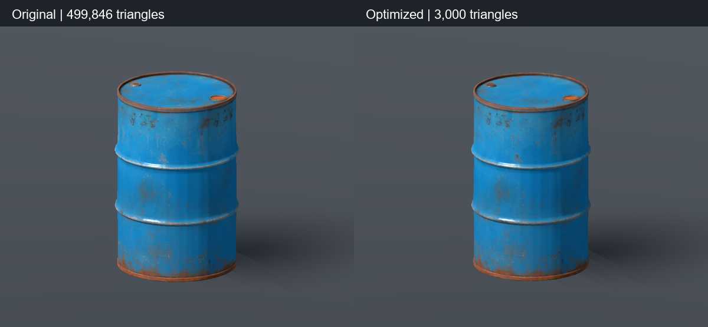

# 油桶 GLB 減面與烘焙試作

日期：2026-10-06。使用者要求先嘗試修改提供的 GLB，必要時使用 Blender MCP。這次完成可檢視的遊戲用候選；沒有替換正式道具、修改玩法或提交 Git。

## 產物與方法

[候選 GLB](../../assets/models/oil_barrel/oil_barrel.glb)、[可編輯 Blender 來源](../../art_source/oil_barrel/oil_barrel_optimized.blend)、[製作參數](../../art_source/oil_barrel/README.md)。來源 Downloads GLB 與 [既有收存原件](../../art_source/retired_props/2026-09-29/oil_barrel.glb) 的 SHA-256 相同，原件未修改。

直接減面會因原網格／UV 切縫產生碎裂；合併頂點後強制減面亦會折疊。成功版本以原 GLB 的副本做 0.0035 m voxel remesh，建立封閉表面，再減至 3,000 三角形。重新展 UV，從原件烘焙顏色、切線法線、金屬／粗糙度；保留原藍色與鏽跡，未進行重新設計或低彩度定稿。

| 指標 | 原 GLB | 候選 GLB |
|---|---:|---:|
| 三角形 | 499,846 | 3,000 |
| 匯出頂點 | 324,320 | 2,558 |
| 唯一幾何位置 | 249,597 | 1,502 |
| GLB 位元組 | 16,769,764 | 2,948,012 |
| 材質 | 1 | 1 |
| 貼圖 | 2 張 1k WebP | 3 張 1k PNG，新增法線 |
| 幾何開放邊／非流形邊 | 16／381 | 0／0 |
| 必要 glTF 擴充 | EXT_texture_webp | 無 |

面數減少約 99.4%，GLB 本體減少約 82.4%；不代表 FPS 同比例提升，這次沒有量測多桶 FPS。Godot 採預設抽出貼圖匯入設定，遊戲資產目錄另含三張 PNG 及對應 `.import`，這些檔案須一起保留。

候選 bounds 約 0.6583 × 1.0000 × 0.6587 m，Y-up；整個外觀收在既有半徑 0.32958984 m、高 1 m 的圓柱碰撞範圍內。規格對照 [建模需求](../modeling/requests/oil-barrel/oil-barrel.md)。

減面後、尺寸正規化前，抽樣原件每 32 個頂點，共 10,135 點，量測到低模的最近表面距離：平均約 2.25 mm、99 百分位約 8.72 mm、最大約 13.06 mm。這是單向有限抽樣，不是雙向 Hausdorff 上界；最後尺寸調整與碰撞邊界限制不包含在該量測內。

## 本輪自動檢查

- [audit.py](oil-barrel-optimization/audit.py) 與 [audit.json](oil-barrel-optimization/audit.json)：核對檔案雜湊、GLB 封裝、有限座標／屬性、有效索引、3,000 三角形、0 退化三角形、0 非流形邊、0 開放邊、碰撞體積、1 scene／node／mesh／material、三張 1k 貼圖與無必要擴充。
- Godot 4.7.2 實際 editor import 建立 PackedScene；[匯入日誌](oil-barrel-optimization/godot-import.log) 顯示資產匯入完成，退出碼 0。引擎另報受限環境無法讀取 root certificate store、不能儲存使用者 editor settings；不宣稱整份 editor 日誌沒有錯誤。
- 實際載入匯入後 PackedScene 成功，mesh 為 2,558 頂點／3,000 三角形；三張貼圖與 normal enabled 均可讀。GLB 無帶入 Blender 原場景的 Cube。
- [Compatibility 渲染日誌](oil-barrel-optimization/godot-preview.log) 有 shader cache 寫入錯誤，影像仍成功輸出。後續 [Forward+ 原件](oil-barrel-optimization/godot-source-forward.log) 與 [Forward+ 候選](oil-barrel-optimization/godot-optimized-forward.log) 都成功渲染、輸出 PNG、退出碼 0；只見上述 certificate store 訊息，沒有腳本／模型載入錯誤。

## 本輪畫面觀察

使用 Godot 4.7.2 Forward+、Vulkan、RTX 4060 Laptop GPU。以獨立預覽程式建立相同鏡頭與光照，自動儲存 framebuffer 後退出，沒有以桌面按鍵操作遊戲或編輯器。原件保留原尺寸，候選使用道具規格；比較圖不是正式主世界畫面。



桶身輪廓、兩條桶箍、桶蓋雙桶口與鏽跡位置可辨，沒有直接減面時出現的 UV 碎裂或桶身折疊。法線貼圖承接凹痕；桶蓋／細小邊缘較原件柔化。此版本足以作後續整合候選，未宣稱近距離外觀完全相同。

## 重現與尚未驗證

預覽程式保存為 [preview.gd.txt](oil-barrel-optimization/preview.gd.txt)。複製至 `.godot/oil_barrel_audit.gd` 後，從專案根目錄執行：

```powershell
godot --headless --editor --path . --import
godot --path . --log-file .godot/oil-barrel-preview.log --script .godot/oil_barrel_audit.gd -- res://assets/models/oil_barrel/oil_barrel.glb res://docs/validation/oil-barrel-optimization/optimized.png
```

`audit.py` 需 Python、NumPy 與 Pillow；讀取資產，輸出 audit.json，兩張預覽存在時會更新 comparison.png。

正式 [props/oil_barrel.tscn](../../props/oil_barrel.tscn) 仍使用灰盒，因此未做拾取／丟棄、回收、握持、保存、多桶效能或正式世界光照驗收，未執行 full suite。整合時須保留根節點、物品程式、質量、碰撞、GripLeft／GripRight 與保存場景路徑。來源作者與授權仍未核實。
