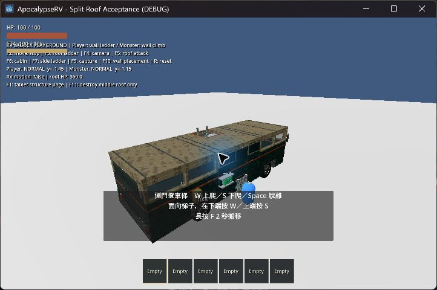
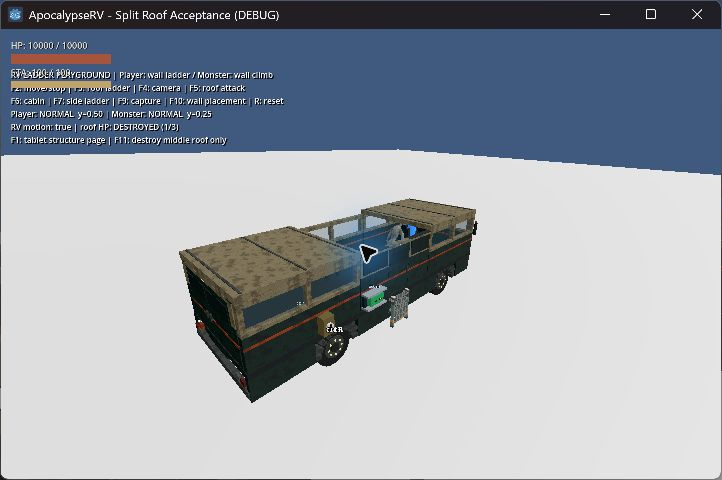
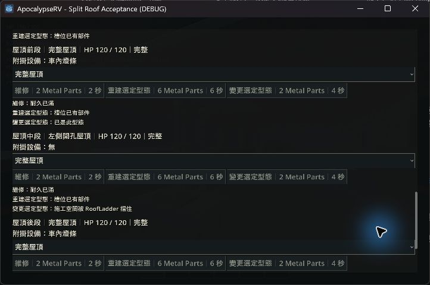

# 三片屋頂與左側梯子洞口驗證

日期：2026-10-06。Windows、Godot 4.7.2、Jolt。

## 行為

- 屋頂分前、中、後三個固定槽位 `roof_0/1/2`，每片 4 × 4 m、50 kg、120 HP；總重仍為 150 kg，完整車輛重心不變。
- 三槽均可在平板選擇完整屋頂或左側開孔屋頂，維修／重建／換型沿用既有交易規則。換型保留耐久比例，不能直接拆成空槽。
- 開口位於每片局部 x=-1.8～-0.35、z=-0.8～0.8，淨空 1.45 × 1.6 m；模型與四塊碰撞一致，沒有活動蓋板。初始配置為完整／開孔／完整。
- 現有車內梯移至左中牆，對準中段洞口。梯子仍是可搬移設備；放置與爬行保留實際碰撞檢查。梯子或角色佔用洞口時，不能直接施工封住洞口。
- 三片獨立破壞、維修、重建及保存。前後燈條分別依附前後屋頂；雨、霧遮蔽依各片實際固體範圍，洞口及毀壞位置保持暴露。
- 車體共十二槽。檢查點格式維持 v4，但舊十槽 v4 資料因布局不相容而拒絕載入；不自動補片、不改寫原檔，需要重新開局。

## 本輪自動檢查

18 個不同的行為測試及正式主場景啟動通過，另通過資產匯入。這次未重跑完整套件，不沿用前輪 full 的結果作為本次結果。

| 批次 | 結果 | 日誌目錄（`.godot/test-logs/`） |
|---|---|---|
| 結構、施工、保存、車燈、天氣、攀爬與怪物 | 10 項中 9 PASS；攀梯新增位移斷言首輪失敗，修正測試後單獨通過 | `20261006-002453-017-selected-38364` |
| 設備生命週期、攀爬動畫／能力／大型物品、磁碟保存、車輛機械／操控／物理、主場景 | 9/9 PASS | `20261006-002648-077-selected-39592` |
| 攀梯位移重測 | 1/1 PASS | `20261006-003004-508-selected-13280` |
| 最終攀梯、移動車身與攀梯動畫回歸 | 3/3 PASS，確認同時更新的梯子過渡程式與屋頂最終版本配合正常 | `20261006-003643-721-selected-29568` |

攀梯位移測試改以進入梯子前的實際 NORMAL 步行速度計算第一幀預算，保留已攀附、進入及登頂過渡的原速度限制，並加入失敗幀／狀態診斷。上下行、屋頂支撐、動態車身、怪物拆頂和碰撞檢查均保留。

首輪沙箱匯入無法寫入 Godot 使用者編輯器設定；以正常 Godot 權限重跑匯入通過。日誌 `20261006-002413-017-selected-31280` 保留該環境失敗，不計為行為測試結果。

## 本輪原生視窗觀察

使用 computer-use 的 sky 操作獨立 `ApocalypseRV - Split Roof Acceptance (DEBUG)` 遊戲視窗。

1. 車內可看見左牆梯子直接對準左側洞口，車頂可見前、中、後三片接縫。
2. F3 使用正式梯子攀爬流程，玩家由車內登頂；怪物保留車壁攀爬。回放中車輛移動／轉彎，兩者到達屋頂。
3. F5 入座後，以 F11 測試捷徑只傷害中段：中段完整消失，前後兩片保持；HUD 顯示 `DESTROYED (1/3)`，原站在中段的怪物落入車內。怪物自主逐片拆頂另由行為測試驗證。
4. 實際平板的車體頁分列三個屋頂槽位，各有 HP、附掛設備、型態和施工按鈕；選單包含完整／左側開孔屋頂。中段選完整型態時顯示現有梯子擋住施工空間。







原生日誌：`.godot/split-roof-native.log`，未出現 script／engine error。本次遊戲視窗已關閉，保留原有 Godot 編輯器。回放為腳本車身運動，不以此宣稱輪驅極限、翻覆或群怪已完成實機驗收。屋頂型態互換、扣料與碰撞阻擋由自動測試覆蓋；本次桌面只檢查選單及原因，沒有用滑鼠完成換型。

## 重現

```powershell
godot --path . --log-file .godot/split-roof-native.log res://tests/rv_roof_playground.tscn -- --art-review
```

沿用攀梯測試場：F3 登頂回放、F5 入座、F6 車內／外鏡頭、R 重設；本場新增 F1 平板、F11 只拆中段。歷史十槽改版與右側梯子驗收保留原樣。
