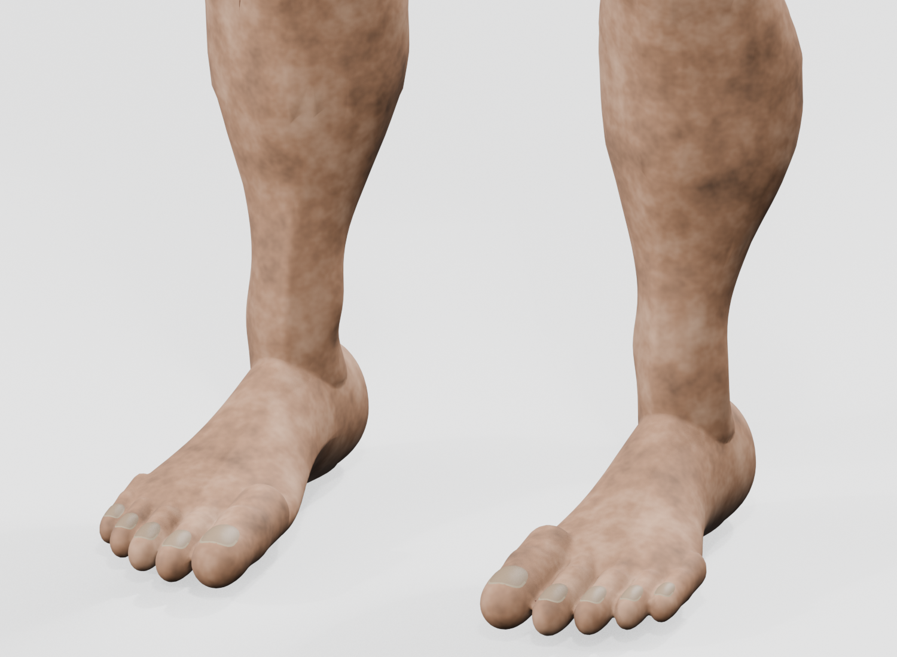
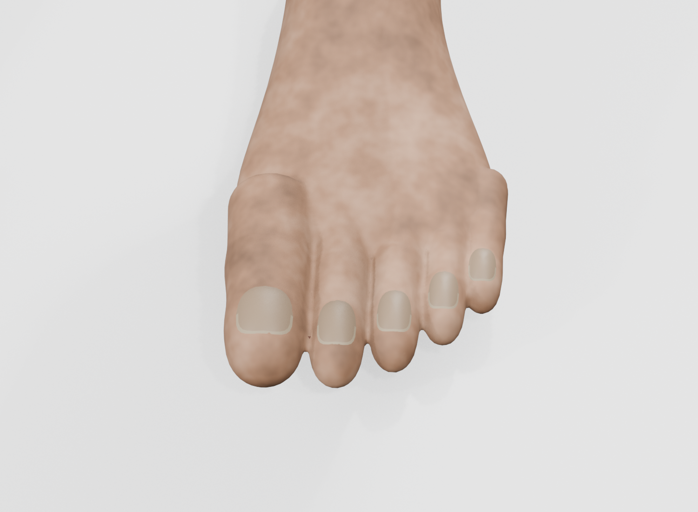
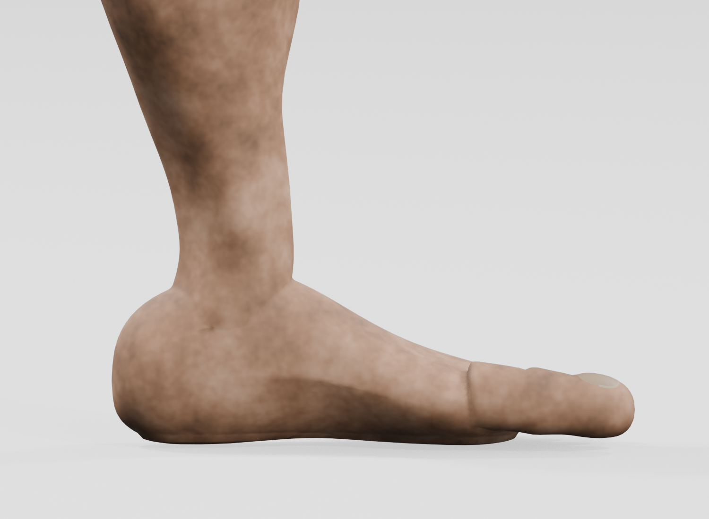
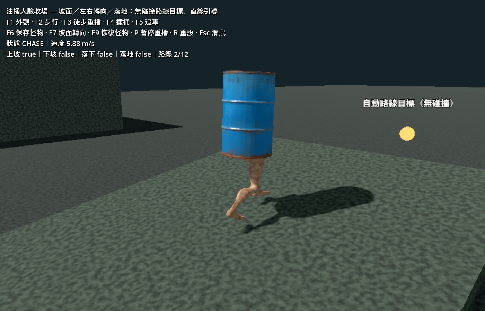
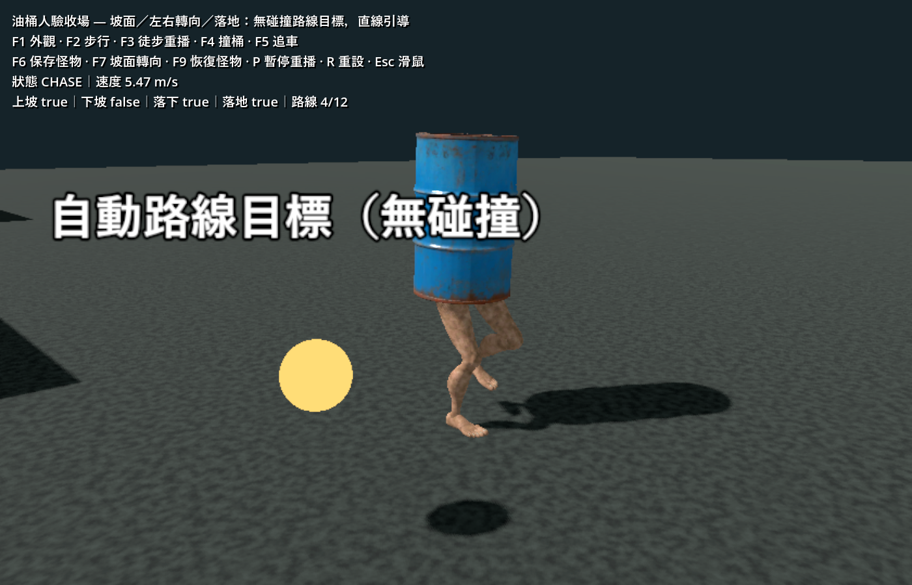

# 油桶人腳踝、腳掌與腳趾細修

2026-10-07。本次依「把腳踝、腳掌、腳趾做好一點」更新美術及蒙皮，使用 **Blender 5.2.2 LTS + Blender MCP** 完成建模、UV、烘焙、檢視與 GLB 匯出。

## 變更

- 重新塑造高低錯開的內外踝、阿基里斯腱與腳跟銜接，移除初版球狀踝部。
- 收窄腳掌，建立腳跟肉墊、腰部收束、內侧足弓及前掌外緣。五趾有不同長度、寬度、趾腹和淺關節皺褶。
- 趾甲改為貼合實際趾面的小型曲面，邊緣嵌入皮膚，保留窄自由緣，取代原先浮起的橢圓片。
- 限制踝部的 shin/foot 混合權重範圍，避免彎踝時拉扯整片脚背；沿用 11 骨架及十組動畫。雙腿與趾甲共 **42,846 三角面**，低於原先 45,000 預算，膚色貼圖為 **2048²**。
- 修正重複烘焙後 Blender packed PNG 過期的問題：保存後解除舊打包、重新讀取、再打包。GLB 內嵌圖片與磁碟烘焙圖片逐像素相同，Godot 重新匯入後腿部黑縫消失。

[可編輯來源與製作順序](../../art_source/barrel_man/README.md)；[遊戲資產](../../assets/models/barrel_man/README.md)。初版 `.blend`／GLB 另存於 `art_source/barrel_man/versions/feet_v1/`；原油桶與其他既有工作保留。AI、傷害、生成與保存規則未在本次修改。

## 本輪自動檢查

命令：`scripts/test.ps1 -Godot <Godot_console.exe> -TestFilter test_barrel_man_assets.gd -Smoke`。

最終日誌：`.godot/test-logs/20261007-154102-256-selected-36184/`。Godot 4.7.2：匯入、資產測試及正式主場景啟動全部通過。

- 匯入後逐一檢查十組動畫、共 504 個取樣姿勢，包含權重正規化、骨架、循環端點、爆點掛點、偽裝桶內淨空及蹬地高度保留。
- 偽裝最大水平半徑 **0.23192 m**，最低點 **0.02999 m**；全部皮膚與趾甲藏在桶內。
- 跑步／快跑最低點約 **−3.26／−5.92 mm**，通過既有 25 mm 穿地容差；這不是「每一頂點永遠高於地面」的保證。
- Blender 網格检查：左右腿均為封閉網格，邊界邊、非流形邊和孤立頂點皆為 0。
- 最終 GLB 內嵌 PNG 與保存的膚色 PNG 逐像素一致；未覆蓋 UV 背景也有膚色，不再是黑色。

完整數值：[asset-audit.json](barrel-man-feet/asset-audit.json)。本次未將初版功能回歸紀錄當作重跑結果；AI、爆炸和保存測試的先前結果見[初版驗收](2026-10-07-barrel-man.md)。

## 實際畫面觀察

Blender 檢查腳部正面、後跟、單腳內側足弓、五趾近景、跑步、快跑、起身與偽裝。Godot 使用 Forward+／RTX 4060 Laptop GPU，在正式油桶人展示場播放連續坡面路線；完成 12 個路線點，HUD 記錄上坡、下坡、落下與落地均已發生。另切換 F1 檢查普通桶、偽裝、起收腿及 6／10 m/s 展示。未見趾甲脫離、踝部斷面或舊貼圖黑縫。

原生日誌：`.godot/barrel-feet-final-native.log`，未見 script error。以下皆為直接渲染／遊戲擷取，沒有修圖。

## 範圍與限制

本次驗證的是美術、蒙皮及既有動作在展示場的呈現，未重測車輛爆炸、地堡往返、長時間群怪或所有程序地形。五趾共用既有 toes 骨做前掌蹬地，沒有新增每趾獨立抓握動作；腳底仍使用原本有限高度修正。
