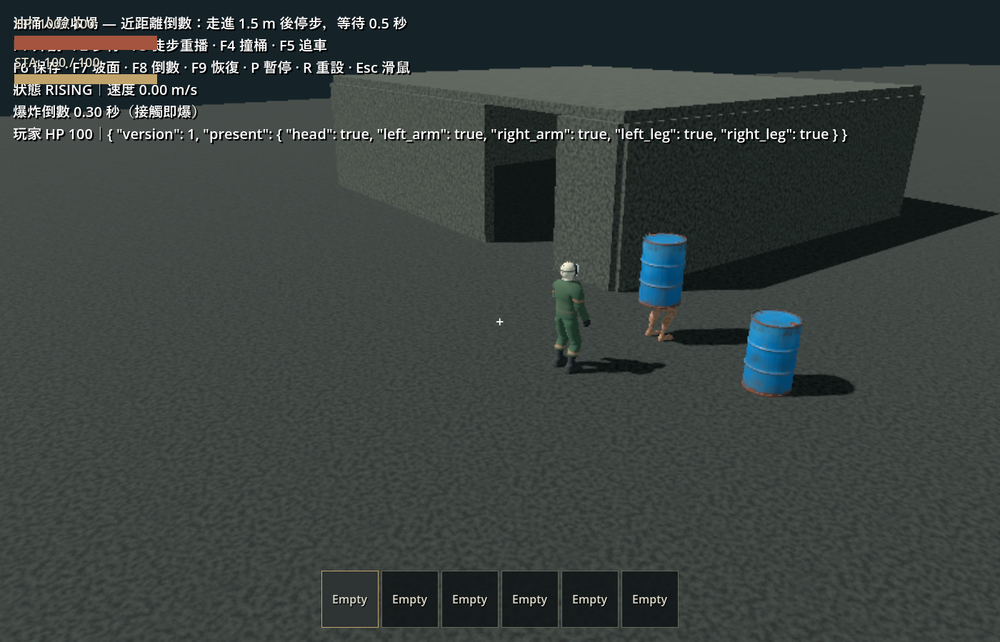
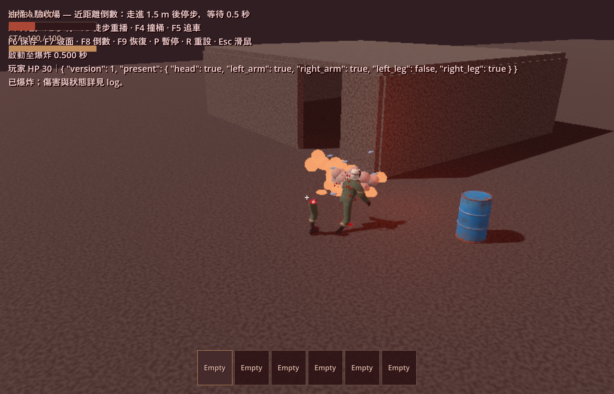

# 油桶人近距離倒數

2026-10-07。玩家／真實車體碰撞表面進入桶身中心 **1.5 m** 且无遮挡時，啟動 **0.5 秒**倒數。倒數期間保留正常追逐，目標離開不取消；真實玩家／車體接觸及致命傷直接立即自爆。傷害半徑仍為 4 m，傷害與斷肢數值不變。

[行為實作](../../enemies/barrel_man.gd)、[可調設定](../../enemies/barrel_man_settings.gd)。近距離查詢只接受啟用的真實碰撞表面，排除 Area、Item／其子碰撞及其他 World3D，不由前方探針啟動。剩餘倒數以可選 `proximity_fuse_remaining` 保存；舊 checkpoint v5 記錄缺少此欄時仍視為未啟動。

## 自動測試

- `test_barrel_man`：1.51／1.49 m 邊界、車尾恰好 1.5 m、0.499 秒存活、0.5 秒到期、精確 30 個 60 Hz tick、持續追逐、離開範圍後繼續倒數、倒數期間玩家／RV 接觸立即引爆、重複通知去重、遮擋、Item 子碰撞及跨世界隔離。
- `test_barrel_man_persistence`：剩餘倒數往返、恢復後續跑、舊記錄相容、非法值拒絕及自爆後不保存。
- `test_barrel_vehicle_contact`：原有低速／高速、車尾、側面與完整傷害回歸通過。測試明確將 proximity radius 設為 0，隔離其原本要驗證的真實車撞路徑。
- `test_barrel_explosion`：既有爆風傷害／遮蔽回歸通過。
- 正式主場景啟動通過。

四項回歸與主場景日誌：`.godot/test-logs/20261007-192230-573-selected-38568/`。修正浮點殘值後，含精確 30 tick 新案例的 actor suite 再次通過：`.godot/test-logs/20261007-194009-810-selected-41648/`。

展示場新增 **F8**／`--proximity-replay`：正式玩家連續前進、倒數啟動後停步，油桶人仍走正式 AI。`--headless-check` 回放通過：玩家移動 1.60 m，倒數於 0.333 s 啟動、0.833 s 引爆，間隔 **0.500 s**，HP 100 → 30；期間怪物沒有碰上玩家。日誌 `.godot/barrel-proximity-replay.log`。

## 實際畫面

使用 Godot 4.7.2／Forward+／RTX 4060 Laptop GPU，啟動正式展示場 F8。觀察到玩家停在桶外、HUD 顯示倒數，隨後爆炸並受傷；原生日誌也記錄 **0.500 s**，未見 script error。

再切換 F3 持續前進：2.000 s 啟動倒數，2.133 s 碰上後立刻引爆，僅過 **0.133 s**，確認接觸沒有等待完整 0.5 秒。

原生日誌：`.godot/barrel-proximity-native.log`。本次未重跑長途串流、群怪壓力或全部地堡情境；這些不是本輪新增測試的覆蓋範圍。建模與動畫未修改。
