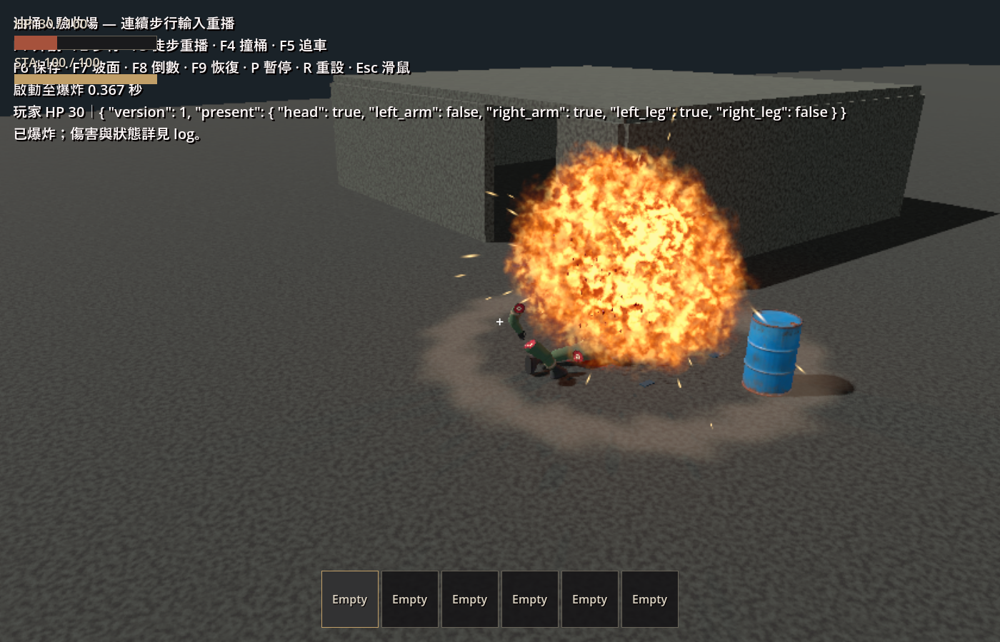
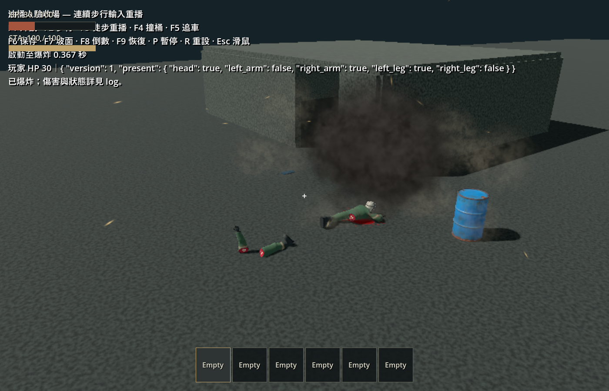
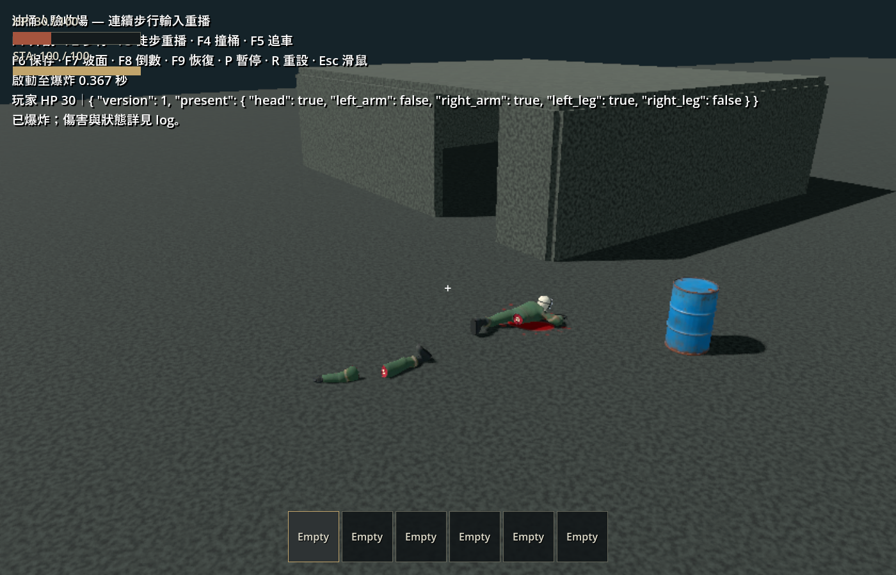

# 油桶人爆炸特效 — 2026-10-07

本輪重做視覺與合成爆炸音效，保留工作樹既有的 3 m 近距離觸發、2 秒倒數、接觸立即引爆及 4 m 傷害半徑。先前 1.5 m／0.5 秒驗收屬歷史結果。本輪沒有改動模型、AI、傷害公式、生成或保存設定。

## 效果

- 短促中心閃光與有陰影的暖色點光，接上噪聲翻捲火球，再冷卻為有明暗層次的黑煙。
- 實體支撐上擴散的壓力環和塵浪；略過角色、斷肢和一般散落剛體，沒有近地支撐時不畫地面環。
- 火星沿飛行方向拉長，藍色金屬碎片旋轉散出；煙霧逐漸上升、變淡，整組 3.8 秒後釋放。
- 深度柔化減少火煙與地面交界的硬切線；128 × 128 共用噪聲與 1.65 秒原創合成音效預先烘焙，避免第一次爆炸才生成。
- 特效加入 WorldEntities 前先設定座標，確保粒子和地面查詢以當下桶身爆點為中心。各次爆炸材質時間獨立，無碰撞、持續傷害或可拾取殘骸。

來源與重建方式見 [authoring README](../../art_source/barrel_vfx/README.md)，遊戲資源見 [asset README](../../assets/effects/barrel_blast/README.md)。

## 本輪自動檢查

指令：`scripts/test.ps1 -Godot <Godot_console.exe> -TestFilter 'test_barrel_explosion.gd,test_barrel_vehicle_contact.gd' -Smoke`。

最後一輪記錄：`.godot/test-logs/20261007-204201-389-selected-39512/`。

| 檢查 | 結果 |
|---|---|
| 資產匯入 | PASS |
| `test_barrel_explosion` | PASS；原有傷害／遮擋／世界隔離，加上位移容器爆點、地面環位置、無碰撞、重疊效果材質獨立及到期釋放 |
| `test_barrel_vehicle_contact` | PASS；正式車體接觸與探針隔離回歸 |
| 正式主場景啟動 | PASS |
| `git diff --check` | PASS |

加入 PNG/WAV 後第一次匯入曾在掃描前回報 preload 尚無 importer；當次已完成資產匯入，後续兩輪完整匯入與測試均通過。未聲稱執行 full suite。

## 實際畫面

Godot 4.7.2 Forward+、RTX 4060 Laptop、1400 × 900，使用正式玩家連續步行接近怪物的 F3 重播。Log：`.godot/barrel-vfx-final-native.log`，無 script/shader errors。於 2.133 秒接觸爆炸，玩家 100 → 30 HP，附近普通油桶留存。

下圖是原始遊戲截圖，沒有後製效果。畫面中的測試 HUD 與玩家 HUD 有既有重疊；未將此版 HUD 當正式 UI 驗收。

`tests/barrel_man_playground.gd -- --replay --capture` 已擴充爆後擷取時點到 4 秒，方便檢查煙霧收尾。檔名中的 `blast+050` 等為目標時點，實際擷取時間以檔名的 `t` 和 log 為準，受影像讀回排程影響。

## 未驗證與中止

使用者按實體 Esc 中止 Computer Use 後，已停止桌面控制並保留遊戲視窗；未繼續操作 F4 車撞畫面。車撞本輪只有自動回歸結果；車內／夜間視覺、Compatibility renderer、大量同時爆炸效能與主觀音效聆聽未驗證。粒子不做剛體反彈或流體牆面模擬；傷害遮擋仍沿正式爆炸判定。

技術參考：[Godot spatial shaders](https://docs.godotengine.org/en/stable/tutorials/shaders/shader_reference/spatial_shader.html)、[CPUParticles3D](https://docs.godotengine.org/en/stable/classes/class_cpuparticles3d.html)。
