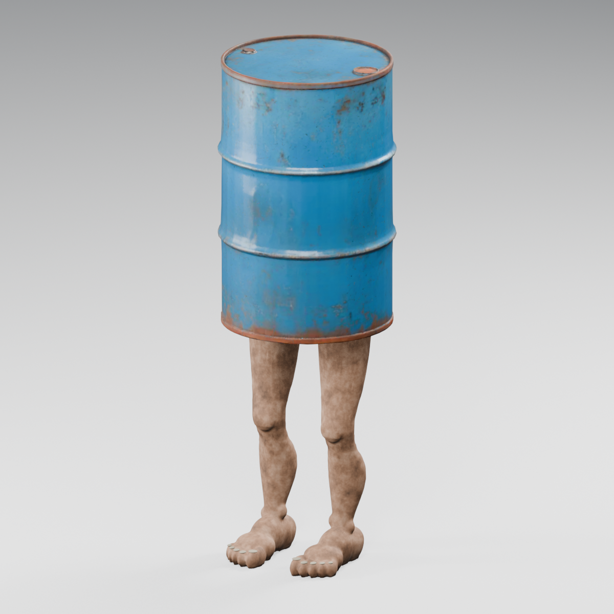

# 油桶人行為、爆炸與保存驗證

日期：2026-10-07。已完成模型與正式遊戲接入、統一 runner 回歸、Blender 渲染及 Godot 原生視窗觀察。以下分開記錄自動檢查、實際畫面與尚未驗證範圍；不代表 full suite 全部通過。

## 實作與契約

- [BarrelMan](../../enemies/barrel_man.gd) 繼承 Monster 的群組、導航及世界生命週期，採偽裝、起身、追逐、收腿、自爆的獨立狀態機，不執行一般近戰、抓咬或攀車。玩家 8 m、車輛 12 m 喚醒；起身需有淨空。優先玩家，玩家入座後追該車外表面；追人 6 m/s，追車最高 10 m/s。非致命傷喚醒，致命傷與真實玩家／車體接觸立即鎖定自爆。前方探針不引爆。
- [BarrelExplosion](../../enemies/barrel_explosion.gd) 在任何扣血、斷肢或拆殼之前收集全部受害者、碰撞表面距離及遮蔽。每個來源只處理一次，每位玩家、車板與引擎分別去重；已在當幀鎖定死亡的來源仍能結算。完整車殼擋住當次爆風，已存在破口可曝露玩家。Item 免怪物傷害，Item 接觸不轉交父底盤；支撐車板被毀時仍沿原 ItemMount 流程掉落。沒有其他怪物連鎖自爆。
- 玩家 1.5 m 內 70 HP，至 4 m 線性衰減；1.5 m 內從尚存四肢抽一肢，0.8 m 內最多抽兩肢，從不抽頭。`Player.apply_explosion_hit` 使用一次 0.5 秒受傷冷卻判定，先斷肢再提交死亡；同一爆炸的所有斷肢共用切斷前的角色／平台速度與爆風，避免第一肢使玩家離座後改變第二肢的速度。
- 車殼 2 m 內 120 HP、引擎 60 HP，至 4 m 衰減。引擎以曝露車殼／底盤的最近表面判斷；實際車體接觸可直接授權一次引擎傷害，車尾不因底盤中心距離過遠漏傷。讓路時保留既有 RV 速度修正，省略一般撞怪額外扣血；後續地面撞擊仍使用原 VehicleImpact 計費。
- v8 道路、貨物／棚屋據點敵人名額與新訪地堡分別以 10%、15%、20% 的獨立種類 RNG 替換成油桶人。原敵人數量、選點及物資 RNG 保留；貨物／棚屋據點另有一個普通 Item 油桶對照。道路根原點去除原 Raker 的 0.5 m 抬高，據點取實際地面，地堡沿用地面出生點。
- [WorldActorSnapshot](../../core/world_actor_snapshot.gd) 保存活油桶人的物種、HP、變換、階段與過渡進度，恢復後重新找同世界目標；自爆後不保存。可信任場景白名單允許油桶人作為 monster，禁止作為 Item。維持 checkpoint v5／地形 v8，v2–v7 戶外種類不變，已生成或清空區域按原記錄恢復，不補怪或普通油桶。

數值集中於 [BarrelManSettings](../../enemies/barrel_man_settings.gd)。爆炸火光、煙塵、碎片與聲音為短暫效果，不帶拾取／存檔身份。

## 本版實際執行的自動檢查

Windows／Godot **4.7.2 stable**，headless／dummy。統一 `scripts/test.ps1` 執行 **22 項不同檢查（含正式主場景 smoke）全部 PASS**，另完成四種展示場 bounded replay。最後模型與貼地修改另跑資產專項。新測試已登錄 `tests/suites.json`。

| 測試 | 實際結果與覆蓋 |
|---|---|
| [test_barrel_explosion.gd](../../tests/test_barrel_explosion.gd) | PASS：表面距離與傷害邊界、一次受傷 gate、兩肢無重複抽取、缺肢、致命傷順序、已死來源／玩家、座位與移動速度、完整車殼當次遮蔽與下次破口、部分曝露膠囊、多 shape 車板去重、車尾引擎傷害、外部障礙阻擋引擎、Item 免傷與支撐掉落、拒絕 Item 與其子碰撞體的父底盤傷害轉移、無怪物連鎖、獨立 World3D。 |
| [test_barrel_man.gd](../../tests/test_barrel_man.gd) | PASS：感知、起身進度、加速追逐與上限、失去目標收腿、低頂等待、玩家／車體真接觸、探針不引爆、玩家優先／入座改追車、過渡狀態驗證、跨世界拒絕。 |
| [test_barrel_man_persistence.gd](../../tests/test_barrel_man_persistence.gd) | PASS：四種存活階段與 HP／變換精確存讀、拒絕死亡／非有限狀態／跨物種欄位、舊 Raker 記錄、50 個 seed 的名額與 loot RNG 保留、兩種怪物均出現、地面根原點、普通油桶保存、重訪與已清空據點不補出。 |
| [test_barrel_vehicle_contact.gd](../../tests/test_barrel_vehicle_contact.gd) | PASS：正式 RV 真實物理接觸，前方 0.7／12 m/s、倒車車尾 6 m/s、側面 6 m/s；去重、自爆後來源移除、車輛讓路及一般撞怪免重扣。完整爆炸案例的引擎損失 61.076 HP，其中自爆 60、後續地面撞擊約 1.076；測試分別核對兩筆。 |
| [test_player_dismemberment.gd](../../tests/test_player_dismemberment.gd) | PASS：既有五切口、重複拒絕、斷肢效果、能力、存讀／World3D 轉移、抓咬與復活回歸。 |
| [test_road_spawns.gd](../../tests/test_road_spawns.gd) | PASS：v8 生成確定性、安全區、淨空與 legacy 隔離；本次輸出 strips 104、wrecks 74、monster slots 234、blocked 26。 |
| [test_barrel_man_assets.gd](../../tests/test_barrel_man_assets.gd) | PASS：40,224 三角面、11 骨、10 動畫、四權重歸一、循環端點、每個 60 Hz 匯入姿勢、偽裝藏腿、桶壁交界、爆點與獨立實例。另以真正平地碰撞確認貼地保留蹬地腳踝高度。 |
| 既有行為／資產回歸 | PASS：`test_vehicle_monster_impact`、`test_vehicle_impact`、`test_item_services`、`test_item_navigation`、`test_monster_navigation`、`test_poi_asset_kit`。 |
| 世界生命週期 | PASS：`test_road_spawn_lifecycle`、`test_road_spawn_checkpoint`、`test_bunker_content`、`test_bunker_encounter`、`test_bunker_cache`、`test_poi_transition_persistence`、`test_streaming_generation`、`test_outdoor_minor_persistence`。 |
| 正式主場景 | PASS：`main-scene` smoke，出現 `WORLD_READY_FOR_PLAY`，完成就緒與移動檢查。 |

可重跑：

```powershell
./scripts/test.ps1 -Godot 'C:\Users\evan4\AppData\Local\Programs\Godot\Godot_console.exe' -TestFilter 'test_barrel_*.gd,test_vehicle_monster_impact.gd,test_vehicle_impact.gd,test_player_dismemberment.gd,test_road_spawns.gd,test_road_spawn_lifecycle.gd,test_road_spawn_checkpoint.gd,test_bunker_content.gd,test_bunker_encounter.gd,test_item_services.gd,test_item_navigation.gd,test_monster_navigation.gd,test_poi_asset_kit.gd' -Smoke
./scripts/test.ps1 -Godot 'C:\Users\evan4\AppData\Local\Programs\Godot\Godot_console.exe' -TestFilter 'test_bunker_cache.gd,test_poi_transition_persistence.gd,test_streaming_generation.gd,test_outdoor_minor_persistence.gd' -SkipImport
```

統一 runner 日誌：`.godot/test-logs/20261007-140624-589-selected-15412/`（18 項，115.61 秒）、`20261007-141038-768-selected-6832/`（4 項，38.93 秒）。最後 GLB 幾何驗收在 `20261007-141448-901-selected-19300/`；貼地回歸在 `20261007-142500-905-selected-21792/`。開發直接測試另有 `.godot/test-logs/barrel-review/`。APPDATA 分別隔離到專案 `.godot/barrel-appdata` 與 `.godot/barrel-gui-appdata`，沒有使用玩家平常的存檔。

## Blender 與 Godot 畫面觀察

全程由 **Blender MCP** 執行建模、蒙皮、動畫、檢視與匯出；保留 [獨立 .blend 與製作腳本](../../art_source/barrel_man/README.md)。原油桶 GLB 未改動，普通 Item、地堡裝飾桶、怪物骨架掛點共用它。腿部含膝、小腿、踝、腳跟、足弓、五趾及趾甲；一張 1024² 污垢膚色圖。



[腳部近景](barrel-man/blender-feet.png)、[偽裝](barrel-man/blender-disguised.png)、[起身](barrel-man/blender-rising.png)、[快跑](barrel-man/blender-sprint.png)。曾在快跑看到上腿從桶壁露出，已調整重心／桶身高度；起身重新調整髖部路徑。最終 Godot [逐幀數值](barrel-man/asset-audit.json)：偽裝腿部最大半徑 0.25921 m；起身／收腿在桶底以上的最大半徑 0.31316 m，小於桶半徑 0.32959 m；十組動畫平地最大腳底侵入約 6.42 mm，沒有大幅穿地。站立足底約在 y=0。

原生觀察使用 `computer-use` / `@oai/sky` 選取唯一 `ApocalypseRV - Barrel Man (DEBUG)` 視窗，Vulkan Forward+／RTX 4060 Laptop。用 F1 檢視普通桶對照、起身／收腿與 6／10 m/s 動畫；F3／F4／F5 是持續輸入／輪驅重播，沒有用短按 W 代替。畫面為專案當前畫質設定。

| 情境 | Headless 及原生結果 |
|---|---|
| F3 連續步行 | 2.13 秒接觸爆炸，玩家 100→30 HP、隨機失去兩個尚存肢體；普通桶留下。不同重播抽中不同組合。觀察到斷肢、血跡及怪物消失，[畫面](barrel-man/godot-player-blast.png)。 |
| F4 輪驅撞偽裝桶 | RV 真正輪驅移動 19.38 m，4.38 秒撞桶；引擎 450→390，兩片車殼毀損，撞後仍向前。此例僅凍結怪物 AI 以隔離偽裝接觸，[結果](barrel-man/godot-vehicle-blast.png)。 |
| F5 從後追車 | 怪物追上仍在加油前進的 RV，2.25 秒爆炸；當時 RV 約 3.81 m/s，引擎 450→390，三片車殼毀損，[結果](barrel-man/godot-chase-blast.png)。 |
| F7 坡面／轉向 | 12 路點，位移 28.11 m，最大水平速度 6.01 m/s；物理檢查上下坡、落下、落地均出現，左右累計轉向各 4.14／10.42 rad。近景 [坡面](barrel-man/godot-slope.png)、[轉向](barrel-man/godot-turn.png) 已檢視。無碰撞標示目標與關閉該實例導航是測試引導，生產加速／重力／碰撞／動畫保持運作。 |

爆炸 [火光](barrel-man/godot-fire.png)、[煙塵與藍色碎片](barrel-man/godot-smoke.png) 的有限時間序列已渲染檢查。效果約 2.2 秒後移除，不產生可拾取怪物屍體。聲音已接入空間播放，但未以聽音設備評估音量平衡。

原生日誌為 `.godot/barrel-gui.log`、`.godot/barrel-gui-final.log`；最後貼地修正另以 `.godot/barrel-grounding-final.log` 重新目視，無腳本錯誤。展示場檢查日誌為 `.godot/barrel-playground-headless-f3.log`、`f4.log`、`f5.log`、`f7.log`，最後坡面更新另有 `.godot/barrel-terrain-final.log`。保留 runner [核心結果](barrel-man/results-core.json)、[世界結果](barrel-man/results-world.json)、[最終資產結果](barrel-man/results-assets.json)。操作及限制見 [展示場指南](../guides/playgrounds.md#barrel-man)。

## 未驗證情境與限制

- 10 m/s 上限有邏輯測試及動畫姿勢驗收；原生追車為短距離、较低車速，尚未完整觀察接近 36 km/h 的長距離輪驅追逐、翻車、密集群怪及長局效能。
- 戶外檢查點、地堡／POI 轉場、據點重訪與串流已自動驗證；未另外手動完整走一趟戶外→地堡→戶外 F6/F9 流程。房間開口／完整車殼遮蔽由真實物理自動案例覆蓋，原生房間內爆炸未逐一重播。
- 貼地為有限位置修正，不是完整地形步態規劃。已查看 8° 測試坡與轉向樣本；任意崎嶇地形、樓梯／碎石邊緣以及每一幀足底都無穿插尚未保證。
- 距離使用生產場景的盒、球、膠囊與圓柱形狀投影，凸／凹多面體以真實三角形表面求最近點；遮蔽使用最近點與有限表面樣本，開門／破殼與部分曝露已有回歸，任意細小裂縫的完整可見面積判定未驗收。
- 開發期間未固定隨機的幾次退出曾間歇回報 ObjectDB 清理警告；verbose 重跑與最後固定 seed、延長清理幀的爆炸測試未出現警告。目前沒有定位到可重現的資源洩漏，不將這些重跑當作全部情境零洩漏的證明。
