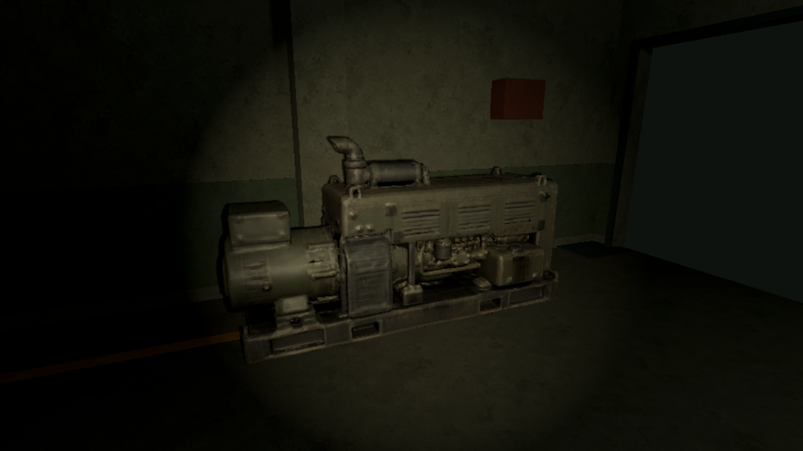

# 柴油發電機與 3D skills 實測

日期：2026-10-07。使用者要求以固定 bunker 柴油發電機實測 ComfyUI／3D scene skills，發現問題直接修正。本紀錄只描述本輪執行；未把既有歷史通過列為本輪結果。

## 交付與整合

[遊戲 GLB／三張 1024² 貼圖](../../assets/models/bunker_diesel_generator/README.md)、[來源與重建腳本](../../art_source/bunker_diesel_generator/README.md)。可編輯來源為 glTF＋BIN＋外部 PNG；未依賴 Blender MCP，也沒有交付 `.blend`。

只變更 [diesel_generator_graybox.tscn](../../world/poi_kit/furniture/bunker/diesel_generator_graybox.tscn) 的視覺子樹：新增 `Visuals/Model/Generator`，將原 `Blockout`、`Cover`、`Stencil` 隱藏，所有原節點名稱、類型與碰撞設定保留；正式 `hall_02.tscn` 位置、旋轉、燈光及其他家具未改動。

最終成品 19,968 三角形／20,921 頂點，單 mesh／材質，三張內嵌 PNG。來源 raw 49,923 面，SHA-256 `34a0f1f5cfa865acfa07970ceda8199ff77e2264662350cb108fd04887007b8c`；降面後完成 GLB SHA-256 `d56287c965afa510a022fcbc5041bb0d079cbca7d4b6dfa6b5abe7b897ea799d`。初次 49k 完成版本保存在本機忽略的工作封存內，SHA `2466a3e847a9429229ff63c0970bf01d410afe0e74d94fcb7abebaa56912c91d`。

設計目標 3.20 W × 1.70 H × 1.20 D m，並非從灰盒量得的成品數據。raw 先旋轉、校正尺度及原點，降面後再微調尺寸與底部中心；降面更新拓樸、頂點及 UV，三張貼圖 bytes 不變，最後 fit 保留降面候選的索引與 UV。詳細尺度與法線／切線處理見 [refinement.json](../../art_source/bunker_diesel_generator/refinement.json)。Godot 匯入後以所有網格頂點乘節點 transform 計算 AABB，實測約 3.20000005 × 1.70000005 × 1.20000005 m，位置約 (-1.60000002, 0, -0.60000002)，允許 2 mm 浮點／匯入容差。長軸 X、服務面 +Z；wrapper 在房間原有 Y=90° 旋轉後，服務面朝房間中央 +X。

## 實際生成與原生觀察

內建 imagegen 產生一張透明參考圖，提示詞與原圖保存於來源資料夾。啟動既有本機 `Pixal3D-API-v2/start.ps1`，沒有下載權重、安裝依賴、修改服務程式或 preset。ComfyUI 0.38.0、RTX 5070 Ti 16 GB、TRELLIS.2 INT8、1024、seed 42、graph 目標 50k。`preflight` READY，僅提交一次，prompt ID `f32e14f8-54ef-44cc-95f6-c3bd2320904e`；`collect` 保存 raw、實際 conditioning、完整 graph／history 與 SHA，容器、索引、有限座標、三張貼圖驗證通過。

工作完成後確認 API 與 ComfyUI 佇列皆空、程序 PID／執行檔／命令列吻合本輪啟動的兩個服務，僅停止這兩個程序，恢復測試前的未啟動狀態並釋放 GPU。

[最終降面 review](../../art_source/bunker_diesel_generator/validation/review.json) 產生並人工看過 textured／clay 的 front、back、side、oblique、top、underside 共 12 張。完整旋轉前後及降面檢查證據保留在本機忽略工作目錄；Git 只保留摘要與代表圖。固定機器的長低輪廓、罩殼百葉、排氣口、底架及低飽和污損材質可讀。

使用 [preview.gd](../../art_source/bunker_diesel_generator/preview.gd) 載入正式 v2 `hall_02.tscn`，套用正式 `BunkerLighting.apply` 與 `PoiInterior` 的 ambient，Forward+／Vulkan。自動尺寸、底部中心、原節點類型、wrapper 尺寸／位置／layer／mask 與服務面碰撞射線檢查通過；[結果](../../art_source/bunker_diesel_generator/validation/context.json)。

初次 49k 版本另用 computer-use skill 的 `@oai/sky`，從 `list_windows` 唯一選中 `Diesel Generator Review | Power Hall | F2 view / Esc exit`，取得、啟用並觀察測試視窗。F2 切到遠景，再切到正式 flashlight Beam 視角，畫面更新正常；Esc 關閉，重新列窗確認測試視窗已消失。未操作仍開著的 Godot editor。降面後重跑原生 Forward+ capture，重新看過近景／遠景／正式手電筒三張圖，尺寸／碰撞檢查 PASS；沒有重做手動按鍵流程。原生日誌無 SCRIPT ERROR／ERROR。



這是正式房間與 wrapper 的原生觀察，不是完整玩家探索、發電交易或多人／群怪測試。固定道具的功能未新增或改動。

## Skill 問題與修正

- [ComfyUI skill](../../.agents/skills/comfyui-image-to-3d/SKILL.md) 的快檢指令指到不存在的專案 `scripts/review.py`：改成 skill 內完整相對路徑。PATH 無 Python 時補上 `load_workspace_dependencies`／完整執行檔路徑的選項。
- [render_views.gd](../../.agents/skills/comfyui-image-to-3d/scripts/render_views.gd) 原 clay 是 unshaded 全白，無法檢查凹凸；改成受光灰、高 roughness。真實渲染發現原燈光令灰模過曝，再依實圖調整 key／fill／ambient 並加弱底光。新增 underside，與 [review.py](../../.agents/skills/comfyui-image-to-3d/scripts/review.py) 的完整輸出檢查同步。
- [active guide](../guides/image-to-3d-workflow.md) 殘留不存在的 request skill／自訂 agent 連結，並把現行可選步驟寫成必須：移除失效依賴，統一主 agent 直接生成、修整、接入及可選降面。
- [3D scene skill](../../.agents/skills/apocalypse-rv-3d-scenes/SKILL.md) 原本只要 Blender MCP 不可用就要求使用者開 Blender：改成已有 CLI／glTF／Godot 工具足以完成時直接使用；確實需要 Blender 且無替代才詢問。補軸向、原點、設計尺寸與實際場景驗證、保留 wrapper／碰撞／功能。
- 新增 [test_client.py](../../.agents/skills/comfyui-image-to-3d/scripts/test_client.py)：7 項離線不變量檢查，沒有更改 `generate.py` 或增加 GPU 重送。
- 初次未試降面是主 agent 的判斷遺漏；skill 也只寫依用途可選降面，缺少交付前的面數評估提醒。兩個 skill 已明確加入尺寸／距離／同屏量預算評估、成本偏高先試降面、保留高面數要說明理由；50k 是生成預設，不是遊戲預算。仍不設定全資產固定 20k 門檻。降面說明另補 `review.py --candidate` 只接受嚴格簡化腳本的 mapping，不能用在 gltfpack `-sv`。

本輪修正的是專案 `.agents/skills/`。另外已安裝的個人 ComfyUI skill 原本已指示 ApocalypseRV 優先使用這裡的腳本；後續也同步加入精簡 Git 交付規則，保留其其他設定。

## 自動檢查

```powershell
& 'C:/Users/evan4/.cache/codex-runtimes/codex-primary-runtime/dependencies/python/python.exe' -B .agents/skills/comfyui-image-to-3d/scripts/test_client.py -v
& ./scripts/test.ps1 -Godot 'C:/Program Files/godot/godot.exe' -TestFilter 'test_poi_asset_kit.gd,test_bunker_lighting.gd,test_poi_definitions.gd' -Smoke
```

離線 7/7 PASS：busy 不提交、不明提交不重送、input／graph hash 綁定、唯讀且可重收、錯誤 history 拒收、保護既有原檔、拒收 scale／reflection pose。兩個 skill 的 `quick_validate` 通過；active 文件相對連結與 `git diff --check` 通過。

PR 整理時補齊 `prompt.json` 篡改案例，連同 reference 篡改都確認拒收；離線測試重新執行 7/7 PASS。交付 audit 改用保存的原 wrapper／SHA 及精簡歷史結果，重新執行 PASS，避免提交後 HEAD 改變或其他工作區缺 `.godot` cache 而失效。audit 只核對資料及歷史證據，不宣稱重新執行 Godot 行為測試。

保留的 `prompt.json` 透過 `.gitattributes` 維持原始換行 bytes，避免 Git 的 LF 正規化使生成摘要中的 graph SHA 失效；原始完整 job／history 留在忽略工作目錄，必要 reference／prompt SHA 綁定仍可核對。

Godot 4.7.2 selected runner 降面後匯入、`test_bunker_lighting`、`test_poi_asset_kit`、`test_poi_definitions`、main-scene smoke 全部 PASS，耗時 24.703 秒。日誌 `.godot/test-logs/20261007-150202-179-selected-44900/`；[降面後結果](../../art_source/bunker_diesel_generator/validation/runner-results.json)、[交付資料檢查](../../art_source/bunker_diesel_generator/validation/delivery-checks.json)。初次 49k 的 24.329 秒結果保留在本機忽略的舊工作封存；沒有跑 full suite。

## 降面補測

初次交付沒有執行降面。使用者提出後，先以 meshoptimizer 1.3.0 的 `simplify.mjs` 請求 20,000 面；實際 47,063、combined error 0.001967819（上限 0.002），正確回報 TARGET_NOT_REACHED，未使用 Infinity 或 `--force-target`。

再使用[官方 gltfpack 1.3](https://github.com/zeux/meshoptimizer/releases/tag/v1.3)，下載至忽略的 `.godot/gltfpack-1.3/`，未新增全域或遊戲依賴。`-sp -sv -se 0.01 -noq -kn -km`，保留比例 0.4 得到 19,968 面；0.2 得到 15,657 面，後者未達約 10k 的請求。`-se` 是演算法限制，不是經量測的毫米誤差或外觀變化百分比。

以這個可近看、3.2 m 的大型固定設備先試約 20k，對三版本用同一來源基準相機比較六方向、材質／灰模共 36 張；[比較與選擇](../../art_source/bunker_diesel_generator/reduction.json)。15,657 面的排氣管及局部小輪廓變化較明顯，選 19,968，減少約 60.0%。三張圖片 SHA 不變；所選候選再做最大約 0.38% 的尺度微調以恢復設計尺寸，重新渲染 12 張並檢查正式房間。未量測 FPS，不把面數或檔案大小減少等同效能實測。

## 過程中的失敗與限制

初始 8000／8188 均 WinError 10061，沙箱外也相同：服務未啟動，並非生成 graph 故障。既有服務啟動後 preflight／生成正常。shell 無 `python`，改用內建 runtime；實際 Godot 為 PATH 上 `C:/Program Files/godot/godot.exe`。

第一輪沙箱內獨立 review 已渲染，但 user cache 與系統憑證存取報 ERROR，因此維持 UNKNOWN；沙箱外重跑無錯誤並 PASS。初次專案掃描在 autoload 載入 wrapper 時尚未完成新 GLB 匯入，runner 報一次資源載入錯誤；同輪後段已成功匯入，重跑匯入與所選全部檢查通過。一次性預覽腳本的手電筒變數型別與按鍵輪詢在實測修正，最終改成明確 Node3D 型別及 key event，重新 capture／原生觀察均通過。這些早期錯誤不計為成功。

皮帶罩的網孔多為貼圖／法線凹凸；局部生成機件融合、背面近似／重複、底部簡化平面及略圓的邊緣保留。此靜態道具不提供機械動畫或精密接口。未量測多台同屏 FPS；匯入使用預設自動 LOD，沒有把降面或檔案尺寸宣稱為效能提升。

## 後續 Git 交付整理

依使用者要求，兩個專案 skill 與已安裝的個人 ComfyUI skill 加入精簡交付規則：生成 job、候選、批次渲染、失敗輸出、日誌與依賴預設放已忽略的工作目錄；完整驗收仍執行，提交前檢查 staged 路徑、數量與大小，只挑必要來源／重建資料及少量最終證據。

本次全部原始工作產物先移到 `.godot/art-work/bunker_diesel_generator/pr28-original/` 保留本機。Git 的資產來源只保留 raw、必要圖像／graph、editable、重建腳本與摘要，驗證只保留精簡結果及兩張代表圖。沒有加入全域副檔名 ignore，也沒有忽略整個 `art_source/`。

在空 rebuild 目錄從 raw 重新生成高模、gltfpack 候選與最終交付，完成 GLB SHA 仍為 `d56287c965afa510a022fcbc5041bb0d079cbca7d4b6dfa6b5abe7b897ea799d`；資料 audit PASS，不需要先前移出的中間檔。preview 重新執行並把圖片及結果寫到新忽略目錄，尺寸／碰撞檢查 PASS。這次整理沒有重新執行完整行為 suite，既有測試時間與結果仍是上文的歷史紀錄。

另將必要交付檔案複製到不含 `.godot`、Git 歷史或封存候選的獨立暫存目錄，audit 再次 PASS。三份 skill 的 quick_validate 通過，文件相對連結與 staged prompt SHA 通過。PR 最終差異從 249 檔精簡為 46 檔，其中來源資料 25 檔、驗證代表圖僅兩張；正式模型／貼圖 bytes 未變。
