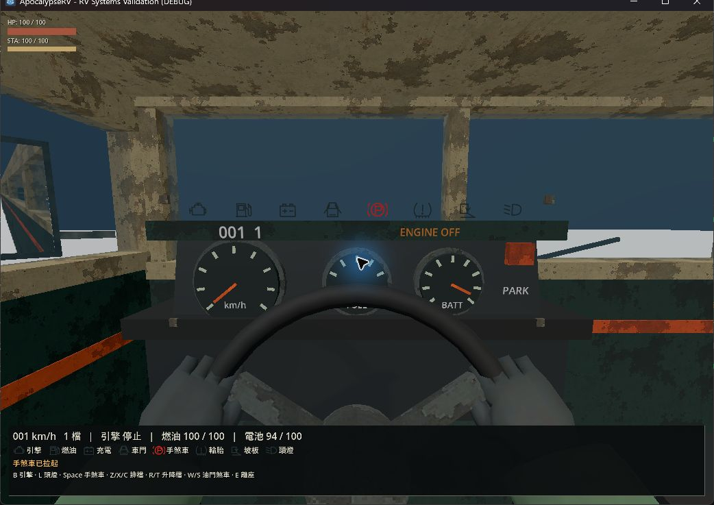
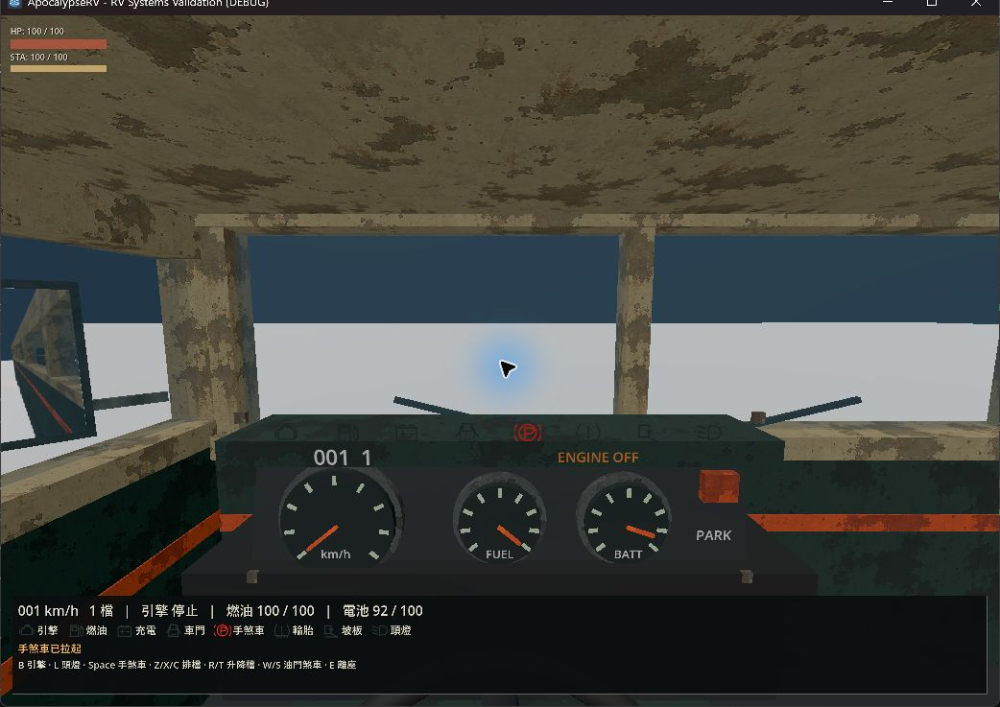

# 駕駛路面視野修正

## 原因及變更

10 月 4 日 `371d1cb` 將 DriverSeat 鏡頭局部高度從 1.62 m 降為 1.325 m，同時將 Z 從 0.05 移至 -0.08。儀表台上緣仍在 1.33 m，因而比鏡頭高 0.5 cm；預設向下視線落在儀表面上，正前方路面被遮擋。前擋風玻璃、窗框及儀表台尺寸沒有同步改動。

本輪將鏡頭高度恢復為 1.62 m；保留目前的前後位置、near、FOV、滑鼠設定與駕駛握姿。地板恢復工作沒有改過這個鏡頭參數。

## 自動驗證

Godot 4.7.2，正式 runner：

- `.godot/test-logs/20261007-201032-498-selected-33656/`：`test_player_head_camera`、`test_settings_menu` 通過。新增視線測試初次使用錯誤前牆節點名，`test_rv_cockpit` 失敗；已改從固定槽位查詢前牆。
- `.godot/test-logs/20261007-201053-075-selected-15804/`：修正後 `test_rv_cockpit` 通過，包含前方路面投影／不透明網格遮擋、握姿、轉向、控制、離座及保存。

新增視線檢查使用正式鏡頭與場景網格，驗證車頭前 15／25／40 m 的平路視線。它不代表任意坡度、改裝座位或所有外掛設備都不會遮擋；本輪未重跑完整套件。

## 原生觀察

依 computer-use 規範，在 `rv_systems_playground.tscn` 使用正式 RV 與 F4 入座。相同場景、預設鏡頭方向比較：修正前正中央只有儀表台與天空，地面僅在兩側窄縫可見；修正後中央可看到儀表台上方的一整段地面。方向盤和玩家身體仍在鏡頭下方，沒有另行更改骨架。

兩次各自記錄至 `.godot/drive-view-before.log`、`.godot/drive-view-after.log`，無腳本錯誤；本次建立的測試視窗已關閉。觀察為靜止車輛，沒有宣稱完成行駛或坡地視野驗收。

| 修正前 | 修正後 |
| --- | --- |
|  |  |
