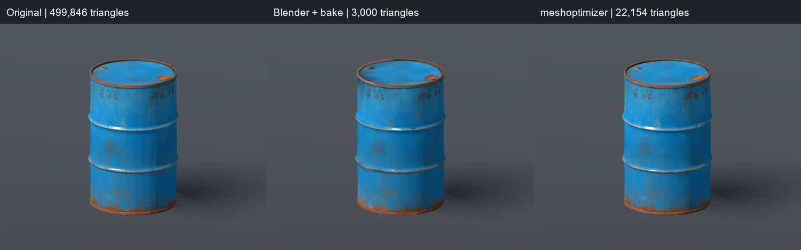
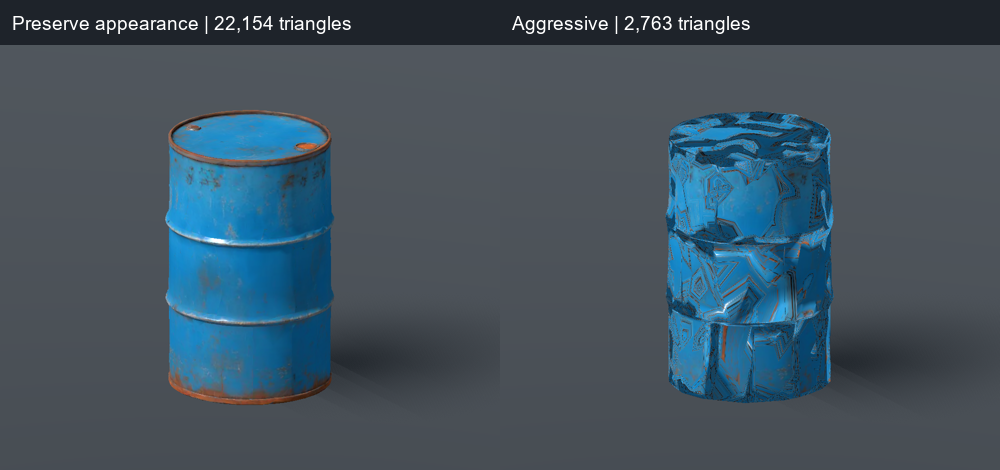

# 油桶 meshoptimizer 實測

日期：2026-10-07。使用者要求試 meshoptimizer，與 [2026-10-06 Blender 減面／烘焙候選](2026-10-06-oil-barrel-optimization.md) 比較。原 GLB、Blender 候選與正式油桶場景均未更動。

## 結果

對這份原 GLB，gltfpack 1.3 很適合快速自動減面，但本輪保留外觀的設定沒有降到 3,000 三角形；達到約 3,000 的 aggressive 模式出現严重 UV 錯亂。現有 Blender 3,000 面版本仍較適合作後續遊戲整合候選。

| 方法 | 實際三角形 | GLB bytes | 本輪判斷 |
|---|---:|---:|---|
| 原件 | 499,846 | 16,769,764 | 比較基準 |
| Blender 網格重整＋烘焙 | 3,000 | 2,948,012 | 外觀接近原件，幾何封閉且無非流形邊 |
| gltfpack strict、1% error | 22,114 | 1,217,468 | 未達目標 |
| gltfpack permissive、1% error | 22,120 | 1,217,728 | 未達目標 |
| gltfpack permissive＋update、1% error | 22,154 | 1,219,660 | 外觀接近原件，仍有 476 個非流形幾何邊 |
| gltfpack permissive＋update、5% error | 18,884 | 1,108,776 | 桶身下部貼圖與局部輪廓可見變化 |
| gltfpack aggressive | 2,763 | 435,144 | 嚴重貼圖錯亂，拒用 |
| gltfpack permissive＋update、error=1 | 0 | 392,236 | 全部幾何被移除，拒用 |

原生工具各單次指令約 0.38–0.46 秒，見 [timings.json](../../art_source/oil_barrel/meshoptimizer-v1.3/timings.json)。計時包含程序啟動／讀寫，排除下載、Godot 預覽與人工觀察；不是批次效能基準或 GPU FPS 測試。

meshoptimizer 的兩張原 WebP 完全保留，逐張核對嵌入圖片 SHA-256 相同，沒有重新烘焙。Blender 版是三張新烘焙 PNG；兩者 GLB 大小差異不能歸因於減面演算法，也不能據此推論顯存或遊戲 FPS。

## 本輪畫面觀察

Godot 4.7.2、Forward+／Vulkan、RTX 4060 Laptop GPU，使用相同鏡頭、光照與尺寸正規化。預覽將每份外觀縮放到相同 0.65917968 × 1 × 0.65917968 m bounds，僅改展示實例；沒有改 GLB 檔案。原件與兩種候選皆為獨立單體預覽，沒有正式世界天氣、霧或手持操作。

permissive＋update 的 22,154 三角形版本能保留桶蓋、桶口、桶箍與鏽跡；表面有少量局部變化，但没有 Blender 初次直接減面時的大幅折疊。5% 版本下部出現局部色塊變化；不能僅以輸出面數判斷品質。

aggressive 的 2,763 面版本出現大片拉伸與交錯線條，無法當作外觀合格的候選。error=1 的極端設定甚至輸出沒有 mesh 的 GLB，雖然工具退出碼仍為 0；因此退出成功不能替代幾何與渲染檢查。

## 執行與驗證

使用 [官方 gltfpack v1.3 Windows release](https://github.com/zeux/meshoptimizer/releases/tag/v1.3)，原件 SHA-256 為 `58326447acdfb7d8ba9fc90c8efc345fd9b8e365d93393f287aba8b192646694`。下載／解壓只在 `.godot/` 暫存，沒有新增全域安裝或專案依賴。

[全部試作與重現腳本](../../art_source/oil_barrel/meshoptimizer-v1.3/README.md) 保留六組參數、GLB、官方 report 與日誌。`-noq -kn -km` 停用量化、保留命名節點／材質；不啟用 mesh compression，避免把解碼支援與減面效果混在一起。目標 `-si 0.006001848` 約為 3,000／499,846；目標不代表一定達到。

[audit.py](oil-barrel-meshoptimizer/audit.py) 與 [audit.json](oil-barrel-meshoptimizer/audit.json) 核對 GLB 封裝、有限座標／屬性、有效索引、面數、頂點、拓撲、圖片與來源／Blender 候選 hash。它會接受「沒有幾何」作失敗試作紀錄，沒有把所有輸出一律標示合格。

Godot 直接讀取 raw GLB，permissive-update、permissive-5pct 與 aggressive 都成功讀取材質和兩張 1k 貼圖、輸出預覽後退出碼 0；分別見 [1% 日誌](oil-barrel-meshoptimizer/permissive-update.log)、[5% 日誌](oil-barrel-meshoptimizer/permissive-5pct.log)、[aggressive 日誌](oil-barrel-meshoptimizer/aggressive.log)。日誌有受限環境不能建立 user shader cache 的訊息，未見腳本或 GLB 載入錯誤。對照 [原件日誌](oil-barrel-meshoptimizer/original.log) 與 [Blender 日誌](oil-barrel-meshoptimizer/blender.log) 亦已保存。

[預覽程式](oil-barrel-meshoptimizer/preview.gd.txt) 複製至 `.godot/oil_barrel_meshopt_preview.gd` 後，用 absolute GLB path 載入，輸出 PNG，自动退出。沒有透過桌面輸入操作編輯器或遊戲。

## 限制與後續選擇

本輪只試 gltfpack 的六組參數，沒有窮舉 meshoptimizer API 的自訂 UV 權重、頂點鎖定或預先拓撲修復；不能據此斷言 meshoptimizer 永遠無法產出合格 3,000 面模型。保留原 UV 的本輪候選仍有非流形邊，未完成碰撞體積／持物尺寸適配。

可把 gltfpack 當作大量 GLB 的第一輪快速減面，再目視挑選；對這個油桶要達到低面數並保住細節，現有 Blender 重整＋烘焙流程較穩妥。正式道具維持灰盒，沒有拾取、保存、多桶 FPS、正式場景光照或全套行為測試。
