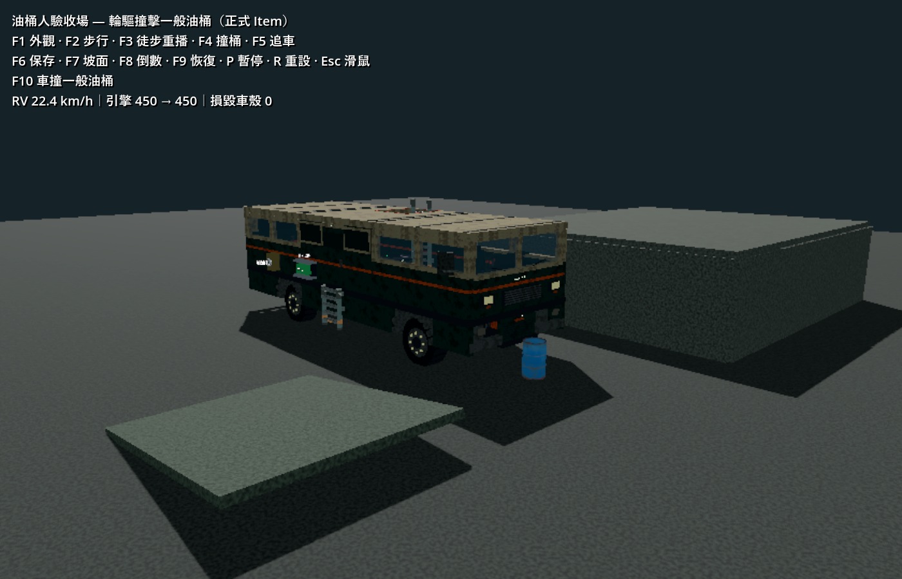
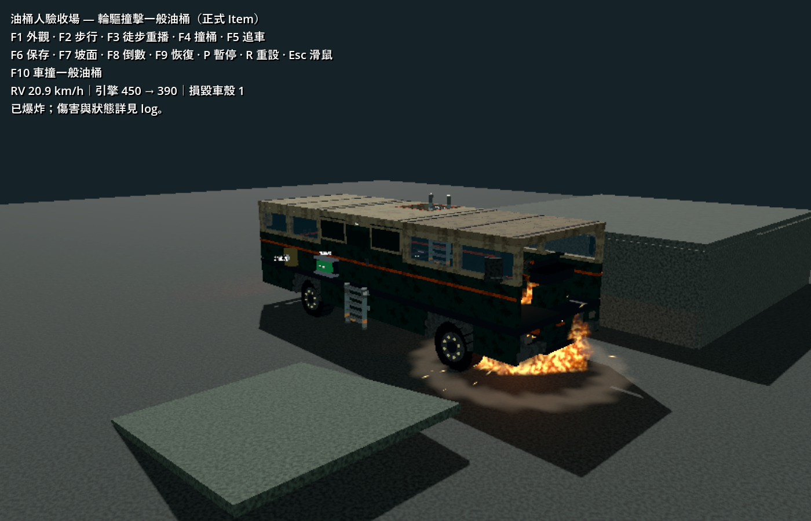
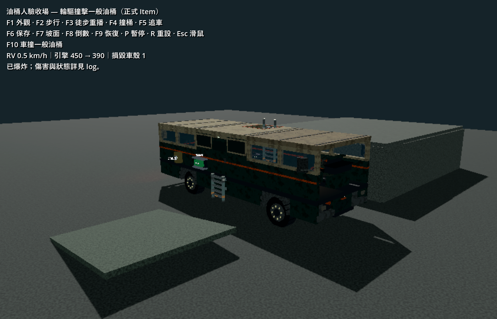

# 一般油桶車撞爆炸 — 2026-10-07

正式 `props/oil_barrel.tscn` 改用 `OilBarrel extends Item`。車身、輪槽或固定在 RV 上的外部設備實際碰到一般油桶時立即爆炸，共用油桶人的傷害、火煙、碎片及聲音。一般油桶沒有近距離倒數或 AI。固定在自車的油桶忽略自車接觸；其他 RV 仍可撞爆它。

玩家推桶、落地、Area 探針、靠近但未接觸、其他爆炸不會引爆。背包／展示預覽、放置中、分解處理中和跨世界接觸皆不觸發。Item 爆風免傷保留，附近油桶不會連鎖。

引爆當下即鎖定毀損並拒絕拾取／世界快照，延後完成傷害與特效後移除。未引爆油桶沿用原 Item 場景路徑、ID、狀態、支撐與物理保存，不升級 checkpoint。

## 本輪自動檢查

最後完整回歸：`.godot/test-logs/20261007-211318-897-selected-4292/`。匯入、下列六支測試及正式主場景 smoke 均 PASS；沒有執行 full suite。

- `test_oil_barrel_vehicle_contact`（新增，integration）
- `test_barrel_explosion`
- `test_barrel_vehicle_contact`
- `test_item_player`
- `test_item_persistence`
- `test_vehicle_impact`

新增測試使用正式 RV／油桶場景，初始碰撞面之間有確認過的空隙；下列所有案例均只產生一次特效、消耗一次油桶、引擎扣 60 HP，沒有額外 body／monster 撞擊扣血。

| 案例 | 起始速度 | 爆後首次採樣速度 |
|---|---:|---:|
| 正面低速 | 0.7 m/s | 0.61 m/s |
| 正面高速 | 12 m/s | 11.31 m/s |
| 倒車車尾 | 6 m/s | 5.63 m/s |
| 側面輪槽／車體 | 6 m/s | 4.39 m/s |
| 側面固定梯架 | 6 m/s | 5.66 m/s |
| 地面固定桶 | 12 m/s | 11.32 m/s |

另驗證靜止重疊接觸、自車載運保護、異車接觸、重複通知、World3D 隔離、預覽／放置／分解保護、Item 存讀、延後爆炸前的快照排除與鄰桶免傷。側面梯架先於車殼接觸的情境單獨保留，且梯架自身仍遵守 Item 免傷契約。

## 正式輪驅與渲染畫面

```powershell
godot --path . --log-file .godot/oil-barrel-wheel-final-native.log res://tests/barrel_man_playground.tscn -- --oil-barrel-replay --headless-check --capture
```

F10／`--oil-barrel-replay` 使用正式 RV 油門與車輪驅動，沒有直接設定車輛位移或呼叫引爆；18 秒模擬後自行退出。前側觀察鏡頭僅屬測試場。

Godot 4.7.2、Forward+、RTX 4060 Laptop、1400 × 900 的自動渲染重播 PASS。已檢視原始擷取畫面，非手動駕駛：4.383 秒碰撞爆炸，引擎 450 → 390，一片車殼損毀，爆後採樣車速 6.23 m/s，整段位移 19.70 m。一般油桶消失，火球與塵浪出現在桶身爆點，車前板留下破口；效果散去後沒有可拾取桶殘骸。最終原生日誌無 script/shader errors 或退出警告，測試視窗自行關閉。







## 限制

沒有手動駕駛、極端高速、翻車、大量油桶或長時間串流測試；地堡純裝飾 StaticBody 桶未改成 Item。首次 headless F10 重播通過但退出時報兩個 ObjectDB 物件殘留，後續兩次原生重播未重現；未定位該 headless 退出警告。既有油桶人近距離參數與其他工作樹改動均保留。
