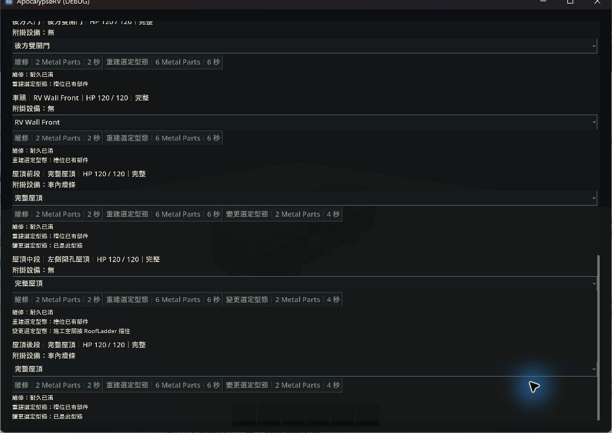
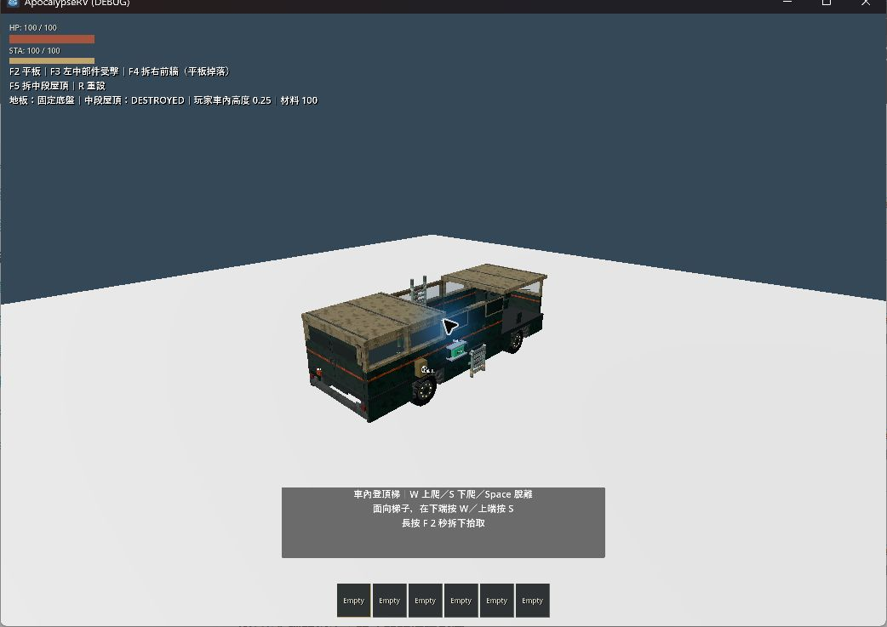

# RV 固定地板恢復驗證

本輪依需求將地板恢復為底盤的一部分；三片屋頂、左側開孔型態及其他車殼功能保留。

## 實作

- `chassis.tscn` 恢復直接隸屬底盤的 Deck／DeckCollision：4 × 0.2 × 12 m，中心高度 0.4 m，使用原有深色材質。沒有第二套獨立地板碰撞。
- 地板不再有結構槽、獨立耐久、破壞或平板施工操作。車殼剩十一槽；地板上的預設 Item 改接底盤支撐。
- 3000 kg 底盤基重重新包含地板，取消原先分離地板重量／重心的補償。完整車輛總重及重心保留。
- v5 十二槽存檔經嚴格驗證後，在記憶體副本移除地板狀態並轉換其 Item 支撐。其他結構損傷、缺口、型態及門角度保留，讀取不改原檔。v1–v4 仍拒絕；不接受畸形地板或指向已毀壞舊地板的附掛。
- 已知毀壞牆／屋頂支撐仍沿用現行 Item 恢復規則：掉落並停止服務，不補回結構。

## 本輪自動測試

Godot 4.7.2.stable.official.ed1daf0bf，使用正式 runner；以下共十三支不同的行為測試及 main-scene smoke 通過。

| 日誌目錄（`.godot/test-logs/`） | 通過項目 |
| --- | --- |
| `20261007-193025-975-selected-33544` | import、moving_rv_climbing、raker_cabin、rv_cockpit、rv_ladders、rv_structure_modules、rv_systems、starting_shelter、main-scene |
| `20261007-193206-847-selected-38276` | rv_checkpoint、rv_handling、rv_physics_regression、rv_structure_snapshot、structure_construction |
| `20261007-193347-986-selected-39608` | 支撐驗證完成後再跑 item_persistence、rv_checkpoint、rv_structure_snapshot |

涵蓋固定地板碰撞與計重、附掛支撐、平板無地板施工、輪驅操控、怪物進出缺口、攀爬、存檔往返、舊 v5 地板轉換、非法資料拒絕及來源檔案不變。初次匯入因沙箱禁止 Godot 使用者設定目錄寫入而中止；提升權限重跑匯入與第一批測試通過。本輪未重跑完整套件。

## 本輪原生觀察

依 computer-use 技能使用 `@oai/sky` 選取唯一測試遊戲視窗，未操作編輯器。啟動命令：

```powershell
godot --path . --log-file .godot/fixed-floor-native.log res://tests/rv_structure_playground.tscn
```

1. F2 開啟正式平板，點選車體結構，捲到底部；清單以屋頂後段結束，沒有地板列或施工操作。三片屋頂列及中段左側開孔型態仍存在。
2. 關閉平板後按 F5 拆中段屋頂、F4 拆右前牆，觀察地板保留、前後屋頂不受影響。HUD 的玩家車內高度持續為 0.25，沒有穿過地板墜落。
3. `.godot/fixed-floor-native.log` 無腳本錯誤。完成後關閉本次測試視窗。





原生觀察使用靜止車輛；本輪沒有人工重播行駛、翻車或群怪情境。相關行駛與攀爬結果來自上列自動測試，與畫面觀察分開記錄。
