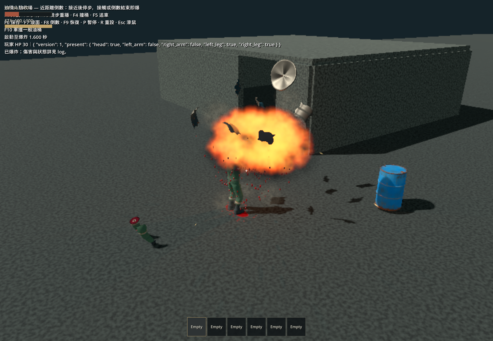
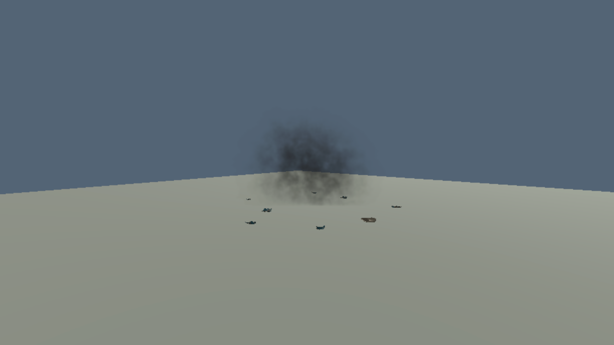

# 2026-10-08 油桶爆炸火煙與金屬碎片

本輪重做油桶人與一般油桶共用的視覺／音效，保留目前 **3 m／2 秒近距離倒數、真接觸立即爆炸**、傷害與保存契約。

## 交付

- Blender MCP 建立燃料／煙霧流體模擬、製作桶蓋與七片彎曲鐵皮，透過 MCP 烘焙、檢視及匯出。可編輯來源：[barrel_blast.blend](../../art_source/barrel_vfx/barrel_blast.blend)；[重建方式](../../art_source/barrel_vfx/README.md)。
- 火煙為兩張 64 格圖集，火焰用較緊取景增加有效解析度。遊戲做相鄰幀插值、快速膨脹、緩慢升煙與消散，約 8 秒清理。移除發光地面圓環，保留不規則揚塵，減少火星。
- 碎片有重力、旋轉、射線反彈／停落與金屬聲；沒有碰撞體、Item 身分或存檔紀錄。音訊限制最多三個同時落地聲、每次爆炸最多五次。
- 爆炸聲改為 3 秒低頻壓力、燃燒轟聲、燃料脈衝與尾響；三種 0.42 秒金屬落地聲。程序生成的原創資源，無外部錄音。
- 圖集正確處理 straight alpha、預乘插值與軟接縫；估算煙霧前緣深度，避免中央平面被車殼一次遮掉。近裁切面另設保護。
- F8 展示檢查改讀實際倒數參數，容許倒數結束前的真接觸引爆，移除舊版寫死的 0.5 秒敘述。

## 自動驗證

Godot 4.7.2；最終圖集重烘後執行的記錄：`.godot/test-logs/20261007-235750-875-selected-45296/`，共 36.50 秒。

| 檢查 | 結果 |
| --- | --- |
| 資源匯入 | PASS |
| test_barrel_explosion | PASS |
| test_barrel_vehicle_contact | PASS |
| test_oil_barrel_vehicle_contact | PASS |
| 正式 main_world 啟動 | PASS |

爆炸測試新增／延伸：平移容器的地面取樣、排除其他 entity domain、八片碎片反彈與停落、無遊戲碰撞／Item／保存身分、落地聲限制、重疊效果材質獨立、結束時釋放碎片。

音效重建可重現；四段 WAV 的 PCM 峰值沒有削波。未以人工聆聽作主觀音質驗收。

## 實際渲染觀察

- Blender MCP 看過火煙渲染與碎片頂視／斜視，確認彎曲、厚度與桶蓋輪廓。
- Forward+ 原生 F8 連續移動重播：`.godot/barrel-realism-player-native-final.log`，PASS。倒數設定 2 秒，1.600 秒時真接觸提前爆炸；玩家 HP 100 → 30，兩個尚存肢體被選中，普通對照桶未連鎖爆炸。
- 原生 F10 輪驅撞一般油桶：`.godot/barrel-realism-wheel-native-final.log`，PASS。接觸速度 6.23 m/s，引擎 450 → 390，一片車殼毀損，車輛繼續行進。這次畫面在最後火焰取景細化前取得；取景細化後再執行上述 F8 及全部列出的自動檢查。
- NVIDIA OpenGL Compatibility 原生 F8：`.godot/barrel-compatibility-guarded-f8.log`，PASS，沒有 shader／script 錯誤；是在同一 shader、最後火焰取景細化前執行。
- 檢视原生逐格畫面，確認橙黃火焰轉為煙、鐵皮飛散及落地、尾段消散。F10 的車體仍會合理遮擋部分火煙；不使用穿牆顯示。
- 下方第二張是本輪隔離視角調整中的煙霧／落地碎片觀察，早於最後火焰取景與深度修正；煙霧素材未再修改。其餘中間畫面留在忽略目錄。

## 成本與限制

八片金屬共 **4,760 三角形**，低於本輪每次爆炸 6,000 的預算；原始資產約 109 KB，不需再降面。兩張 2048² RGBA 貼圖原始 GPU 資料約 **32 MiB**，由所有爆炸共用；圖集禁用 mipmaps 避免鄰格串色。每次只用兩片火煙平面、少量粒子及八片碎片；沒有即時流體求解。

火煙仍為面向鏡頭的預烘焙圖集，深度是近似體積，並非可從任意方向穿行的即時 3D 煙。未完成大量同時爆炸的效能量測、封閉地堡全視角視覺檢查、極近距離穿越煙霧，以及移動／翻覆車輛上碎片持續承載的驗收。這些不影響本輪已通過的傷害遮蔽與接觸契約測試。展示場既有 HUD 文字重疊仍存在。

原始油桶／油桶人資產與其他未提交工作保留，未提交 Git。

