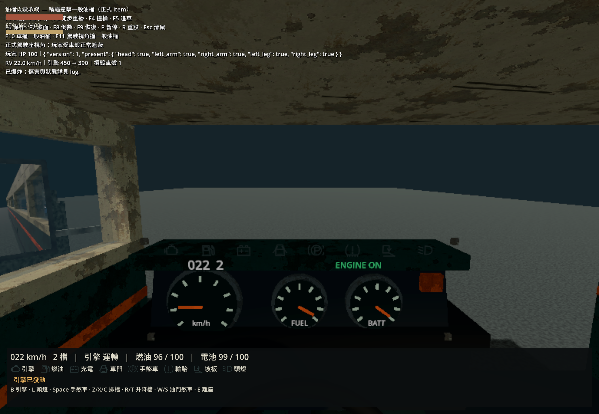
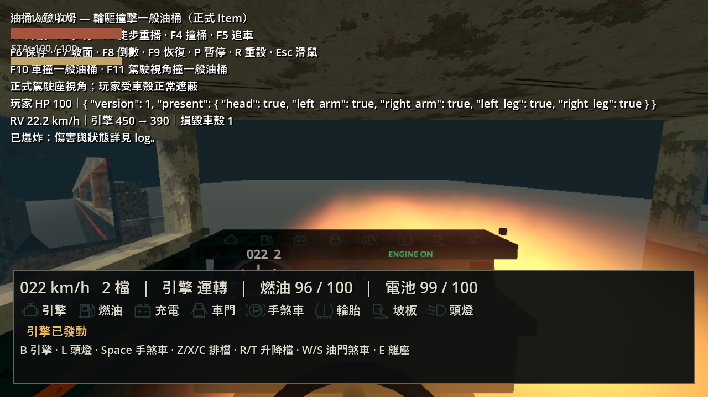
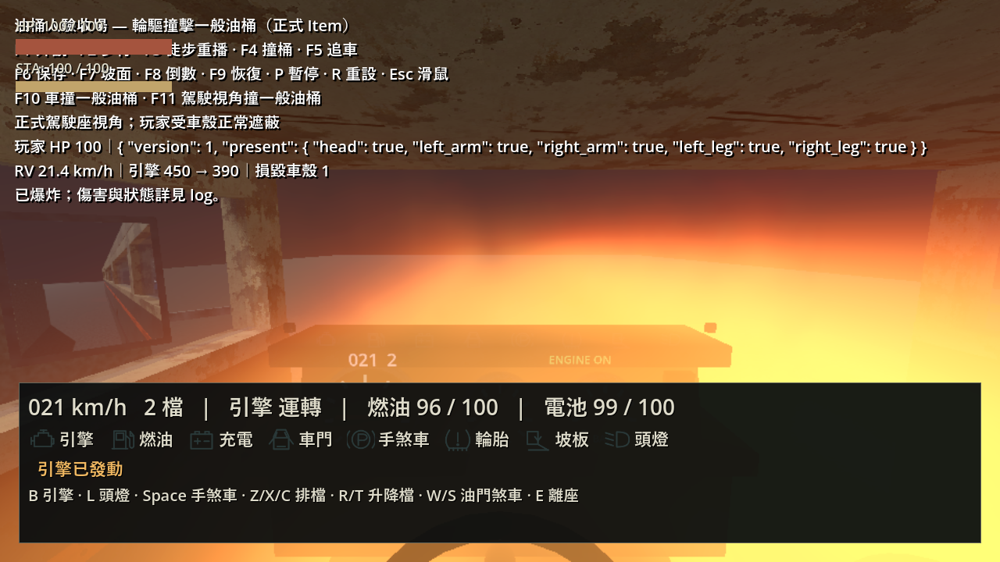
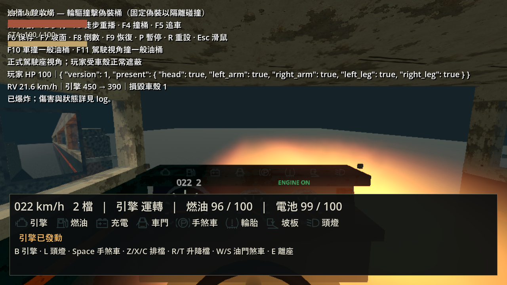

# 2026-10-08 駕駛 POV 撞桶爆炸可見性

修正玩家回報「開車撞桶時駕駛 POV 看不到爆炸」。沿用 Blender MCP 製作的原火煙圖集、碎片與音效；本次改動遊戲渲染及驗收入口，不更改引爆、傷害、AI 或保存。

## 原因與修正

正式玩家入座後重現：低位火焰被儀表板遮住；舊火煙平面在車輛穿過爆點後位於相機後方，GPU 在執行 fragment shader 前便裁掉整片幾何。舊 shader 調整片段深度無法救回未產生的片段，平面 AABB 也沒有涵蓋近似體積。之前的外部輪驅視角沒有覆蓋此問題。

- 改用有界 BoxMesh 體積，在可見射線區間積分 12 個火煙密度樣本，相機進入／穿過中央位置仍可見。CPU 裁切範圍涵蓋實際取樣區域。
- 火焰在最初約 0.1 秒快速膨脹並上升到擋風玻璃可見高度，煙霧緩升；所有移動都在爆點的世界空間，沒有駕駛專用畫面貼片。
- 不透明場景深度截斷積分，完整牆壁仍可遮擋；原生 Forward+ 與 Compatibility 都檢查。透明擋風玻璃沿用原材質。
- 展示場增加 F11／`--driver-pov`，以正式玩家操作正式 DriverSeat；保留真實輪驅、正常受傷與車殼遮蔽。記錄爆炸時目前相機及逐格位置。

## 本次自動檢查

Godot 4.7.2，Windows，RTX 4060 Laptop GPU。統一 runner 記錄：`.godot/test-logs/20261008-005753-669-selected-53924/`，30.94 秒。

| 檢查 | 結果 |
| --- | --- |
| 資源匯入、test_barrel_explosion | PASS |
| test_barrel_vehicle_contact、test_oil_barrel_vehicle_contact | PASS |
| test_barrel_blast_render（headless 結構檢查） | PASS；像素明確 SKIP |
| 正式 main_world 啟動 | PASS |

新增渲染測試登錄 integration；原生另用 1280×720 SubViewport 比較有／無火焰的畫面，煙霧保持存在，排除閃光燈、碎片與火花。測試正式駕駛相機在 0.10／0.25／0.50 秒相對爆點的位置、體積內正反方向、外側及側向視角，皆可辨識火焰；完整不透明牆在切換全部火煙前後為 **0 個變動像素**。

- Forward+：`.godot/barrel-blast-render-native.log`，PASS。
- Compatibility：`.godot/barrel-blast-render-compatibility.log`，PASS。
- headless 日常 runner 只測入座相機所有權、三維邊界與無遊戲碰撞，不能當成畫面驗收。

## 實際畫面觀察

兩次輪驅重播採 `--fixed-fps 60 --resolution 1280x720`，擷取原生渲染影格後檢視；不是手動鍵盤駕駛。爆炸時目前相機均為 `NewRv/Chassis/DriverSeat/Camera3D`。

- 一般油桶：`.godot/barrel-driver-volume.log`，PASS；撞擊後引擎 450 → 390，一片車殼毀損，車輛行駛 19.70 m。撞擊早期可見擋風玻璃前的橙黃火焰，穿入爆點時仍可見；約 0.65 秒轉為暖色薄煙，車子駛過中心後約 1.1 秒前方視野恢復。
- 偽裝油桶人：`.godot/barrel-driver-monster.log`，PASS；引擎 450 → 390，一片車殼毀損，車輛行駛 19.54 m。早期火焰可見。該模式固定偽裝、停用此怪物 AI，以隔離真實車體接觸。
- 兩次駕駛 HP 均為 100，車殼仍提供當次爆炸的傷害遮蔽。確認火光可見不代表傷害穿透車殼。

修正前，已爆炸與受傷但視野沒有火焰（舊重播未使用固定 fps，圖中標籤為排程時間；實際特效年齡約 0.145 秒）：



修正後一般油桶，撞擊早期與穿入火焰：




偽裝油桶人的共用效果：



## 重播與限制

```powershell
godot --path . --fixed-fps 60 --resolution 1280x720 --log-file .godot/oil-barrel-driver-pov.log res://tests/barrel_man_playground.tscn -- --oil-barrel-replay --driver-pov --capture --headless-check
godot --path . --fixed-fps 60 --log-file .godot/barrel-blast-render-native.log -s res://tests/test_barrel_blast_render.gd
```

第一條把 `--oil-barrel-replay` 換成 `--vehicle-replay` 可測偽裝油桶人；第二條加 `--rendering-method gl_compatibility` 可測相容渲染。

本次沒有重新建模或烘焙 Blender 來源。兩張共用圖集仍約 32 MiB；兩個體積代理各 12 三角形，每個有效取樣位置讀相鄰兩幀。比原平面增加片段取樣成本，未量測密集連續爆炸、低階 GPU、任意高速／翻車與密閉地堡的全部角度。火煙是預烘焙輪廓搭配深度分布的近似，不是隨車體／室內幾何流動的即時流體；Compatibility 與 Forward+ 亮度不同。展示場既有 HUD 重疊仍存在。原模型與其他未提交工作保留。
